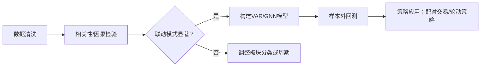

# 联动与扩散

## 一、核心概念与理论基础

### 联动性定义

* 静态关联：不同板块在同一时间段内的收益率相关性（如消费与医药的正相关性）。
* 动态传导：某一板块异动后，其他板块的跟随速度与方向（如金融股上涨后地产股的响应）。
* 结构性分化：牛熊市中联动模式的差异（例如熊市避险板块联动增强）。

### 理论支撑

* 经济产业链传导（如“煤炭涨价→电力成本上升→制造业利润挤压”）。
* 资金流动效应：主力资金在板块间的迁移路径（北向资金、公募调仓）。
* 市场情绪传染：政策利好引发的跨板块乐观情绪扩散（如“碳中和”政策同时拉动新能源与环保）。

## 二、数据准备与处理（量化分析基石）

### 数据源选择

* 板块指数：申万一级/二级行业指数、Wind概念板块指数（确保分类一致性）。
* 高频数据：5分钟/日频收益率数据（捕捉短期联动），月度数据（分析长期趋势）。
* 辅助指标：成交量、资金流入、板块估值（PE/PB）、主力持仓变动。

### 数据清洗要点

* 异常值处理：剔除熔断、政策突发行情（如2016年熔断、2020年疫情首日）。
* 平稳性检验：对收益率序列进行ADF检验，避免伪回归。
* 标准化处理：对跨板块数据做Z-score标准化，消除量纲影响。

## 三、核心分析方法论

### (1) 相关性分析（基础层）

* 滚动相关系数矩阵
  * 计算板块间动态相关系数（如90日滚动窗口），识别阶段性联动变化。
  * 示例：2023年AI板块与算力芯片股的相关系数从0.3升至0.7。
* 格兰杰因果检验
  * 验证板块A的波动是否显著领先于板块B（如“券商上涨是否领先保险股”）。

### (2) 高级计量模型

* 向量自回归（VAR）模型
  * 构建多板块收益率VAR系统，通过脉冲响应分析冲击传导路径（如地产政策放松对家电、建材的传导时滞）。
* 协整检验与误差修正模型（VECM）
  * 分析长期均衡关系（如石油与航空股的负向协整）。
* 复杂网络分析
  * 将板块视为节点，关联性为边权，识别枢纽板块（如银行股在金融网络中的中心性）。

### (3) 机器学习应用

* 聚类分析（K-means/DBSCAN）
  * 根据收益率相似性自动分组板块（如消费、医药常聚为“防御集群”）。
* LSTM时序预测
  * 输入板块A历史数据预测板块B走势（需注意过拟合风险）。
* 图神经网络（GNN）
  * 建模板块间非线性关系，捕捉隐性关联（如供应链上下游影响）。

## 四、联动性驱动因子深度解析

| 因子类型 | 典型代表 | 影响机制 |
|---------|----------|---------|
|宏观经济因子 | CPI/PPI、PMI、利率政策 | 通胀上升时消费与农业股联动增强 |
|产业政策因子 | 新能源补贴、集采政策 | 医药集采导致器械与制药股分化 |
|资金结构因子 | 北向资金持仓、两融余额 | 外资重仓板块同步性更高 |
|市场情绪因子 | 恐慌指数（VIX）、涨停股数量 | 高波动期黄金与国债联动性上升 |
|全球市场传导 | 美股科技股、大宗商品价格 | 特斯拉涨跌传导至A股新能源车板块 |
||||

## 五、实战研究流程设计

### 样本选取

* 时间范围：至少覆盖1轮牛熊周期（如2019-2025）。
* 板块筛选：聚焦高活跃度板块（日均成交额＞50亿），剔除ST板块。

### 模型构建与验证

### 稳健性检验

* 分市场状态测试：牛市/熊市/震荡市中的联动稳定性。
* 参数敏感性分析：调整滚动窗口长度、滞后阶数。
* 排除干扰：控制大盘指数（如沪深300）的影响。

## 六、应用场景与策略输出

### 行业轮动策略

* 依据联动时序差捕捉轮动机会（如金融→地产→建材的传导链）。

### 配对交易（Pair Trading）

* 选择高相关性板块（如白酒与啤酒），做多低估板块、做空高估板块。

### 风险对冲组合

* 利用负相关板块（如黄金与科技股）构建低波动组合。

### 政策响应模型

* 建立“政策→核心受益板块→关联板块”的响应数据库（如“一带一路”政策链）。

## 七、经典案例参考

* 2024年AI革命联动网：
  * 算法公司（寒武纪）→算力硬件（中际旭创）→数据服务（人民网） 传导周期约5个交易日。
* 2020年疫情防御集群：
  * 医药/食品/云计算相关性从0.2升至0.8，与周期股形成显著负相关。

## 八、研究陷阱警示

### 伪相关性陷阱

* 两板块因共同受大盘影响而显虚假关联（需控制市场因子）。

### 结构性断点

* 注册制改革（2023年）后小盘股联动模式剧变。

### 样本偏差

* 使用ETF数据可能忽略板块内部分化（如新能源中锂电与光伏差异）。

## 结论

* 研究A股板块联动性需融合多频段数据、动态计量模型、产业逻辑验证三重维度。重点在于：
* 识别非线性和时变关联（如机器学习捕捉隐性模式）；
* 区分因果与巧合（政策与产业链传导需逻辑闭环）；
* 策略需经极端市场压力测试（如2022年流动性危机）。
* 最终目标是构建“宏观→中观→微观”的联动决策树，实现从统计规律到投资阿尔法的转化。
  