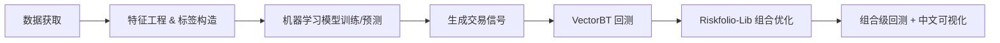

# 任务_工具链

## 任务清单

### 1、行业分类

### 2、资金流分析（Funds）

## 工具链

## 一、数据获取

### akshare

## 二、特征工程&标签构造

### ta_lib 

## 三、模型训练及预测

### 1、XGBoost

### 2、Sklearn Pipeline

## 四、回测

### VectorBT

## 五、动态组合优化

### Riskfolio-Lib