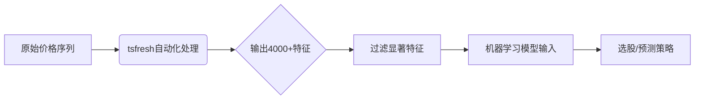

# A股市场使用tsfresh进行自动化特征提取

## 一、TSFresh核心优势与A股适配性



### 为何适合A股

* 1、处理高波动性：自动生成统计/时序特征，捕捉暴涨暴跌模式（如2025年科创板注册制波动）
* 2、适应市场异变：2025年量化新规下，传统技术指标失效加速，需动态挖掘新特征
* 3、降维效率：通过假设检验过滤冗余特征，避免过度拟合（关键！）

## 二、实战操作全流程（附Python代码）

### 步骤1：数据准备——处理A股特性

```python

import tsfresh
import pandas as pd
 
# 加载A股数据（示例：宁德时代2025年分钟级数据）
data = pd.read_csv('300750.SZ_202507.csv',  parse_dates=['timestamp'])
 
# T+1机制适配：将时间戳向前平移1交易日 
data['timestamp'] = data['timestamp'] - pd.Timedelta(days=1)
 
# 处理涨跌停板（2025年新规20%限制）
def limit_adjust(price, prev_close):
    upper = prev_close * 1.2
    lower = prev_close * 0.8 
    return np.clip(price,  lower, upper)
 
data['adj_close'] = data.apply(lambda  x: limit_adjust(x['close'], x['pre_close']), axis=1)
 
# 计算对数收益率
data['return'] = np.log(data['adj_close'])  - np.log(data['adj_close'].shift(1)) 
```

### 步骤2：特征提取——关键配置

```python

from tsfresh import extract_features 
 
# 设置A股专用参数
settings = tsfresh.feature_extraction.settings.EfficientFCParameters() 
 
# 禁用不适用特征（如适用于低频数据的特征）
del settings['linear_trend_timewise']
del settings['cwt_coefficients']
 
# 提取特征（并行加速）
features = extract_features(
    data[['id', 'timestamp', 'return', 'volume']],  # 必须包含id列 
    column_id='id',
    column_sort='timestamp',
    default_fc_parameters=settings,
    n_jobs=8  # 利用多核加速 
)
```

### 步骤3：特征筛选——结合金融先验

```python

from tsfresh.select_features  import select_features
from tsfresh.utilities.dataframe_functions  import impute 
 
# 目标变量构造：未来5日收益率 
data['target'] = data['return'].shift(-5).rolling(5).sum()
 
# 筛选显著特征
impute(features)  # 处理缺失值 
selected_features = select_features(
    features, 
    data['target'], 
    fdr_level=0.001  # 严控假发现率（A股噪声大）
)
 
print(f"显著特征数量: {len(selected_features.columns)}") 
```

## 三、A股场景化特征工程技巧

### 1. 量价融合特征

```python

# 在原始数据中添加量价交互特征
data['vwap'] = (data['volume'] * data['adj_close']).cumsum() / data['volume'].cumsum()
data['volatility_1h'] = data['return'].rolling(60).std()  # 60分钟波动率
```

### 2. 行业概念联动

```python
# 加入行业相对强度（2025年热点：人形机器人概念）
robot_stocks = ['002230.SZ', '603337.SH']  # 概念成分股
data['sector_returns'] = data.groupby('timestamp')['return'].mean()   # 行业平均收益 
```

### 3. 微观结构特征

```python

# 订单簿不平衡度（Level2数据）
data['order_imbalance'] = (data['bid_vol1'] - data['ask_vol1']) / (data['bid_vol1'] + data['ask_vol1'])
```

## 四、特征应用场景与验证

### 场景1：趋势跟踪策略

```python

# 筛选关键特征
trend_features = selected_features.filter(regex='(abs_energy |variance|linear_trend)')
 
# 构建LSTM模型 
model = Sequential([
    LSTM(64, input_shape=(30, len(trend_features.columns))), 
    Dense(1, activation='sigmoid')
])
```

### 场景2：均值回归策略

```python

# 使用反转特征
reversal_features = selected_features.filter(regex='(mean_rev |entropy)')
 
# 配对交易信号生成
z_score = (reversal_features - reversal_features.mean())  / reversal_features.std() 
entry_signal = z_score > 2.5  # 开仓阈值 
```

## 五、性能优化与避坑指南

### 加速方案

|方法 | 效果 | 适用场景 |
|-----|------|-------- |
| 分布式Dask引擎 | 处理速度提升5-10X | 全市场3000+股票分析 |
| 特征提取子集 | 使用MinimalFCParameters | 高频策略开发 |
| GPU加速 | 配置tsfresh.convenience | 深度学习整合场景 |

### A股特有陷阱

* 1、涨跌停扭曲：
  * 在特征计算前执行limit_adjust函数（见步骤1）
  * 剔除连续涨停期间的数据点
* 2、停牌处理：

```python

# 标记停牌日 
data['resumed'] = data['volume'] > 0  
features = extract_features(data[data['resumed']], ...)
```

* 3、未来函数预防：
  * 在extract_features中严格设置column_sort='timestamp'
  * 使用tsfresh.utilities.distribution 的multiprocessing模式避免数据泄露

## 六、2025年前沿扩展

### 1. 结合生成式AI

```python

# 使用LLM生成特征描述（2025新方法）
feature_descriptions = llm_generate_descriptions(selected_features.columns) 
 
# 示例输出：
# "abs_energy: 价格波动绝对能量，反映市场情绪强度"
```

### 2. 实时特征管道


### 3. 监管科技适配

* 特征可解释性报告自动生成（满足《2025量化监管指引》）
* 嵌入ESG评分特征（证监会强制披露要求）

### 工具链升级

* 使用tsfresh-feature-analyzer可视化工具
* 部署到华泰证券QuantOS平台验证

## 结论：最佳实践清单

### 1、数据层：预处理涨跌停/停牌数据 → 构造量价衍生指标

### 2、特征层

* 用EfficientFCParameters提取 → fdr_level=0.001严筛
* 添加行业相对强度特征

### 3、验证层

* 用SHAP值解释特征重要性
* 通过walk-forward回测防止过拟合

### 4、部署层

* Dask加速全市场计算 → 嵌入实盘风控规则

```python

# 最终部署代码示例
pipeline = make_pipeline(
    TSFreshFeatureExtractor(), 
    XGBClassifier(enable_categorical=True)
)
pipeline.fit(X_train,  y_train)
```
