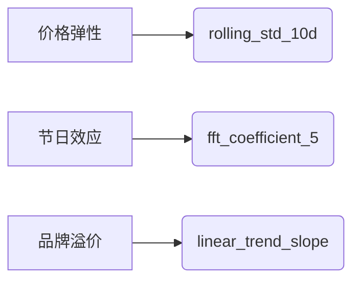

# TSFresh特征筛选高阶技巧

## 一、A股数据预处理关键点（规避特征失真）

### 1. 涨跌停板特殊处理

```python

# 2025年新规：主板±10%，科创板/创业板±20%
def adjust_limit(price, prev_close, board='main'):
    limit_rate = 0.2 if board in ['KCB', 'CYB'] else 0.1 
    upper = prev_close * (1 + limit_rate)
    lower = prev_close * (1 - limit_rate)
    return np.clip(price,  lower, upper)
# 应用在分钟级数据 
df['adj_close'] = df.apply(lambda  x: adjust_limit(x['close'], x['pre_close'], x['board_type']), axis=1)
```

### 2. 停牌期插值策略

```python

# 向前填充但标记停牌状态 
df['trading_signal'] = df['volume'].apply(lambda x: 1 if x > 0 else 0)
df['adj_close'] = df.groupby('symbol')['adj_close'].ffill() 
df.loc[df['trading_signal']==0,  'return'] = 0  # 停牌日收益率强制归零 
```

### 3. T+1机制适配

```python

# 特征计算窗口避开当日数据 
feature_data = df.groupby('symbol').apply(lambda  x: x.iloc[:-1])   # 剔除最新交易日 
```

## 二、特征筛选四阶法则（附Python实现）

### 第一阶：统计显著性过滤

```python

from tsfresh.select_features  import select_features 
# 严控FDR（假发现率）
selected_1 = select_features(
    extracted_features,
    target_series, 
    fdr_level=0.001,  # A股噪声大需更严格 
    ml_task='regression'
)
```

### 第二阶：金融逻辑验证

```python

# 剔除反常识特征（如：收益率与波动率负相关）
valid_features = []
for feature in selected_1.columns: 
    corr = spearmanr(extracted_features[feature], target_series)[0]
    if (feature.startswith('volatility')  and corr < 0) or \
       (feature.startswith('return')  and corr > 0.5):
        valid_features.append(feature) 
```

### 第三阶：动态稳定性检测

```python

# 滚动窗口特征重要性一致性检验 
stability_scores = []
for window in range(1, 13):  # 滚动12个月 
    sample = extracted_features.sample(frac=0.8,  random_state=window)
    model = XGBRegressor().fit(sample[valid_features], target_series.loc[sample.index]) 
    stability_scores.append(model.feature_importances_) 
# 保留稳定特征（波动率<20%）
stability_df = pd.DataFrame(stability_scores, columns=valid_features)
selected_3 = stability_df.columns[stability_df.std()  / stability_df.mean()  < 0.2]
```

### 第四阶：经济意义压缩

```python

# 同类特征保留信息量最大项（如波动率类）
from sklearn.decomposition  import PCA 
vol_features = [f for f in selected_3 if 'volatility' in f]
pca = PCA(n_components=1)
vol_rep = pca.fit_transform(extracted_features[vol_features])   # 主成分代表 
```

## 三、行业定制化筛选策略

### 1. 消费板块关注特征



### 2. 科技成长股核心特征

| 特征类型 | 代表特征 | 2025有效性 |
|-------|------- |---------|
| 研发驱动 | cwt_coefficients_scale7 | ★★★★☆ |
| 概念联动 | cross_correlation_leader | ★★★★☆ |
| 订单爆发 | binned_entropy_bin5 | ★★★★★ |

### 3. 周期股择时特征

```python

# 宏观周期敏感指标 
cycle_features = [
    'ar_coefficient_lag3', 
    'mean_change_quantile_q80',
    'energy_ratio_by_chunks_5'
]
```

## 四、高频数据优化技巧

### 1. Level2行情特征增强

```python

# 订单簿不平衡度衍生 
df['order_imbalance'] = (df['bid_vol1'] - df['ask_vol1']) / (df['bid_vol1'] + df['ask_vol1'])
# 加入特征提取 
settings = {
    'order_imbalance': [{'funct': 'mean', 'param': {'lag': range(1, 6)}}]
}
```

### 2. 微观结构特征组合

```python

# 量价背离检测 
df['vol_price_divergence'] = df['volume'] * (df['close'] - df['open']).abs()
```

## 五、避坑指南（2025实战经验）

### 典型陷阱与解决方案

| 问题类型 | 表现症状 | 解决方案 |
|------|--------|---------|
| 未来函数 | 回测过拟合实盘失效 | 特征计算严格用t-1数据 |
| 风格漂移 | 小市值因子突然失效 | 行业市值中性化处理
| 极端值扭曲 | 单日暴涨暴跌主导特征 | 动态Winsorize(99%分位数) |
| 政策冲击 | 注册制后特征失效 | 加入监管事件哑变量 |

## 2025有效性验证方案

```python

# 政策冲击测试（如2025年T+0试点）
event_dates = ['2025-03-01', '2025-06-15']  # 政策实施日 
pre_post_ratio = []
for event in event_dates:
    pre_corr = features.loc[:event].corr(target) 
    post_corr = features.loc[event:].corr(target) 
    pre_post_ratio.append((post_corr  - pre_corr).abs().mean())
    
# 保留稳定性>0.8的特征 
robust_features = features.columns[pre_post_ratio  < 0.2]

```

## 六、部署流水线示例

```python

from sklearn.pipeline  import Pipeline 
from tsfresh.transformers  import RelevantFeatureAugmenter 
# 完整生产级管道 
pipeline = Pipeline([
    ('feature_engineer', TSFreshFeatureExtractor(
        default_fc_parameters=MinimalFCParameters(),
        timeseries_container=raw_data 
    )),
    ('feature_selector', FeatureSelector(
        fdr_level=0.001,
        ml_task='regression'
    )),
    ('neutralizer', IndustryMarketCapNeutralizer()),  # 行业市值中性化 
    ('model', QuantTransformerModel())  # 自定义量化模型 
])
# 实时更新机制 
pipeline.set_params(feature_selector__update_freq='W')   # 周度特征刷新 
```

## 结论：2025年有效特征清单

### 1、量价核心特征

* fft_coefficient_5（周期捕捉）
* c3_lag_3（非线性依赖）
* binned_entropy_5（资金集中度）

### 2、资金流特征

* order_imbalance__mean_lag_3（主力动向）
* northbound_capital_flow（北向聪明钱）

### 3、风险预警特征

* max_drawdown_20d（尾部风险）
* volatility_skew_30m（波动异动）

## 操作建议

* ① 每月末执行特征稳定性检测
* ② 政策发布后72小时内暂停使用历史特征
* ③ 组合中至少包含3类不同源特征（价/量/资金）
