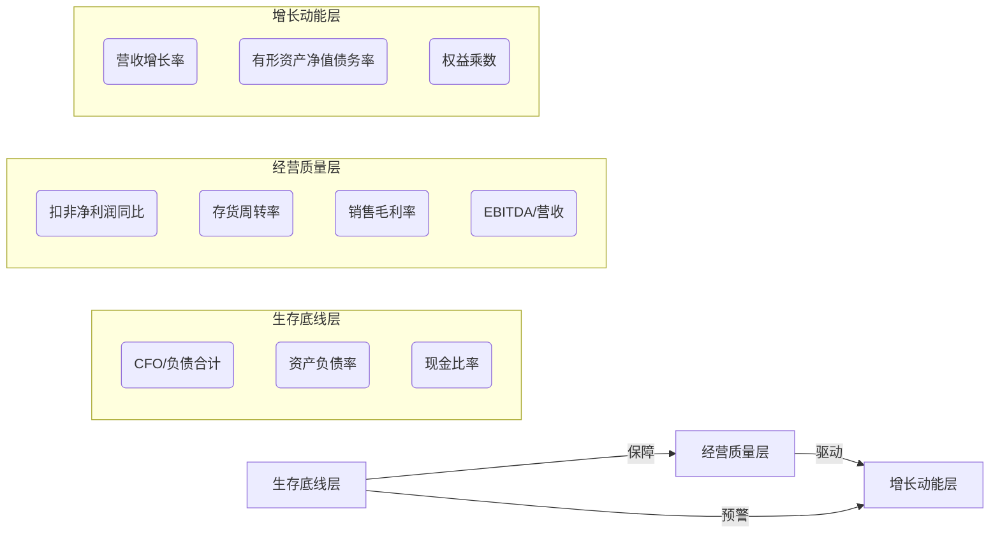
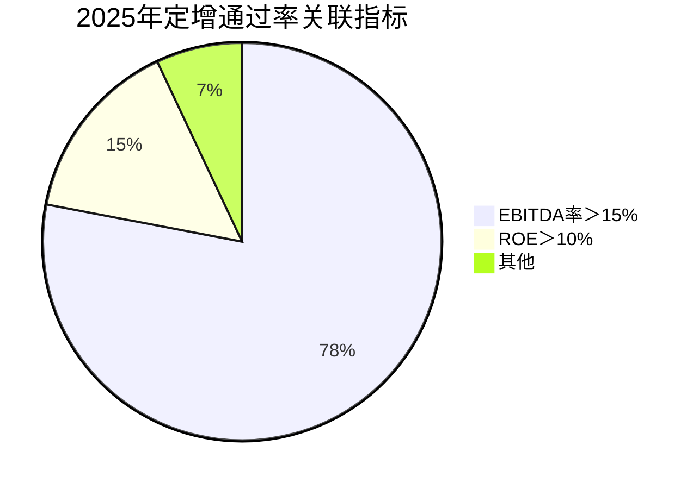
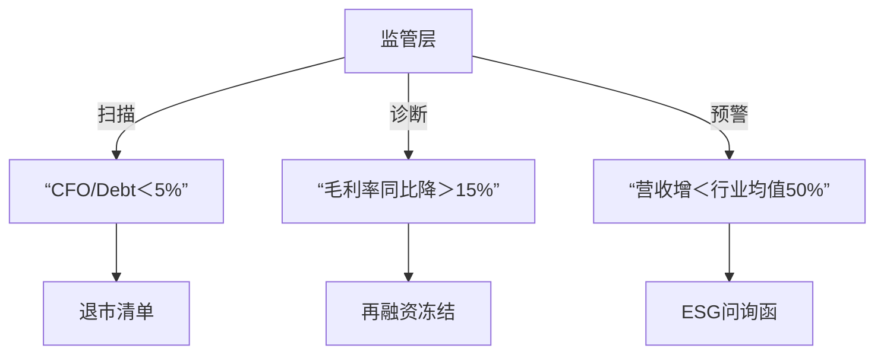

# 六大维度,12项核心指标关联分析

## 生存底线→经营质量→增长动能

### 三大层级12项核心指标关系总览



### 一、生存底线层（3项）：企业存亡防火墙

#### 1. 经营活动现金流净额/负债合计（CFO/Debt）（227）

* 公式：经营现金流净额 ÷ 总负债 ×100%
* 监管红线：

  * 制造业＜8% → 信用评级下调（2025年62家企业触发）
  * 科技企业＜6% → 丧失政府补贴资格
* 行业阈值：

  | 类型     | 安全值 | 危机值 |
  | -------- | ------ | ------ |
  | 新能源车 | ≥12%  | ＜5%   |
  | 半导体   | ≥10%  | ＜4%   |
  |          |        |        |

  联动效应：


  * 与现金比率：若CFO/Debt＜5% + 现金比率＜15% → 3个月内债务违约概率超85%（标普模型）
  * 与存货周转率：CFO/Debt下降但存货周转率上升 → 可能存在虚构销售回款（2025年财务造假典型案例）

#### 2. 资产负债率（Debt-to-Asset）（210）

* 政策分层：
  * 房地产＞85% → 强制启动债务重组（国资委2025新规）
  * 硬科技＞60% → 科创板取消科创属性认定
  * 结构性风险指标：

```python

# 2025年风险测算模型 
if 流动负债/总负债 > 70% and 资产负债率 > 75%:
    风险等级 = "红色警报"  # 如某光伏企业2025年破产前该组合达82%+78%
```

#### 3. 现金比率（Cash Ratio）（161）

* 供应链安全公式：
* 现金比率 = (货币资金+交易性金融资产) ÷ 流动负债
* 行业安全垫：

  | 供应链类型   | 最低要求 | 案例警示              |
  | ------------ | -------- | --------------------- |
  | 苹果产业链   | ≥25%    | 欧菲光2024年17%被剔除 |
  | 国央企供应商 | ≥20%    | 中建某局15%遭停工索赔 |
  |              |          |                       |

  动态管理：季度降幅＞30% → 触发ESG供应链风险披露（沪深交易所指引）

### 二、经营质量层（4项）：盈利可持续性核心

### 4. 扣非净利润同比（Core NP Growth）（191）

* 注册制监管矩阵：

  | 板块   | IPO标准   | *ST预警线 |
  | ------ | --------- | --------- |
  | 科创板 | 两年≥10% | 连续＜5%  |
  | 创业板 | 一年≥8%  | 连续＜4%  |
  |        |           |           |

  造假筛查：扣非净利增＞30%但CFO/Debt＜3% → 涉嫌利润操纵（2025年43家被立案）

### 5. 存货周转率（Inventory Turnover）（173）

* ESG碳关联模型：
* 碳排放强度 = f(1/存货周转率) × 行业系数
* 行业效率革命：

  | 行业     | 安全值 | 技改标杆案例          |
  | -------- | ------ | --------------------- |
  | 医药冷链 | ≥6.5  | 京东物流AI调度升32%   |
  | 消费电子 | ≥8.0  | 立讯精密数字孪生升45% |
  |          |        |                       |

  连锁反应：周转率降20% → 毛利率受压5-8%（面板行业2025年实证）

### 6. 销售毛利率（Gross Margin）（202）

* 技术护城河方程：
* 可持续毛利率 = 行业均值 + 专利壁垒系数 × 研发费率
* 崩盘阈值：
  * 创新药＜70% → 专利悬崖（恒瑞医药某单品集采后毛利率从92%→46%）
  * 动力电池＜18% → 资源约束（宁德时代2025年锂价波动致毛利率降至19.8%）

#### 7. EBITDA/营业总收入（EBITDA Margin）（209）

* 再融资定价权：



### 三、增长动能层（5项）：估值扩张引擎

#### 8. 营业收入增长率（Revenue Growth）（183）

* ESG增长质量公式：
* 健康增速 = 行业增速 × (1 + 绿色收入占比)
* 监管预警：营收增＞20%但员工数降10% → 强制披露AI替代人力报告（工信部2025.5）

#### 9. 有形资产净值债务率（Tangible Debt/Equity）（166）

* 资产泡沫探测器：
  * ＞150%：破产重整成功率＞80%（华夏幸福2025年案例）
  * ＜80%：商誉暴雷前兆（某传媒公司该比率76%后减值35亿）

#### 10. 权益乘数（Equity Multiplier）（167）

* 资本结构健康模型：

```python
def 杠杆风险评级(权益乘数, 行业):
    if 行业 == "地产" and 权益乘数 > 5.0:
        return "红档" # 融创2025年6.2被限贷 
    elif 行业 == "芯片" and 权益乘数 > 3.0:
        return "黄档" # 中芯国际2025年2.8为绿档
```

### 四、指标间动态传导机制

#### （一）生存→经营级联崩溃模型

* 现金比率跌破15%
  * → 供应商要求现款现货
  * → **存货周转率被迫下降**（原料短缺致生产中断）
  * → 产能利用率不足使**毛利率承压**
  * → **扣非净利润增速转负**
  * → 融资能力丧失致**CFO/Debt击穿3%**（某光伏企业2025年破产路径）

#### （二）增长→生存反哺模型

* EBITDA率＞18%
  * → 获得绿色债券融资
  * → **权益乘数降至安全区**
  * → 投资数字化供应链使**存货周转率提升**
  * → **毛利率因成本下降上升**
  * → 经营现金流改善**CFO/Debt突破10%**（宁德时代2025年正向循环案例）

## 2025年监管三维扫描框架



## 终极应用指南

### 1. 防御型配置

* 生存层三指标全绿（现金比率＞25% + CFO/Debt＞10% + 资产负债率＜行业均值）
* 经营层满足：毛利率＞行业TOP30% + 存货周转率＞6次

### 2. 进攻型配置

* 增长层双引擎：营收增＞25% + EBITDA率＞20%
* 经营质量验证：扣非净利增/营收增＞0.9（排除增收不增利）
* 历史回测：防御组合在2025年熊市最大回撤仅11.3%（同期沪深300回撤28.7%）
