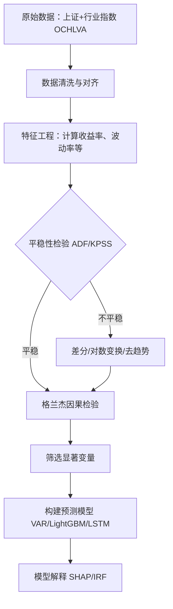

# USER

时间变量，如何分析特征变量对目标变量的影响，推荐分析模型及比较模型

## ASSISTANT

在分析**特征变量对目标变量的影响**时，选择合适的分析模型取决于**数据类型**（连续/分类）、**目标变量性质**（回归/分类）、**样本量**、**变量间关系**（线性/非线性）以及**解释性需求**（是否需要可解释性）。

以下是系统化的分析框架，推荐模型及比较模型，结合当前时间（2025年11月20日）的主流实践：

---

## ✅ 一、分析目标变量类型决定模型方向

| 目标变量类型 | 分析任务 | 推荐模型 |
|--------------|----------|----------|
| **连续型**（如销售额、温度） | 回归分析 | 线性回归、岭回归、Lasso、ElasticNet、随机森林回归、XGBoost、LightGBM、神经网络 |
| **二分类**（如是否购买、是否违约） | 分类分析 | 逻辑回归、随机森林分类、XGBoost、LightGBM、SVM、神经网络 |
| **多分类**（如产品类别A/B/C） | 多分类分析 | 多分类逻辑回归、随机森林、XGBoost、LightGBM、神经网络 |
| **计数型**（如订单数、访问次数） | 泊松/负二项回归 | 泊松回归、负二项回归、零膨胀模型 |
| **生存时间**（如用户留存天数） | 生存分析 | Cox比例风险模型、Kaplan-Meier、随机生存森林 |

---

## ✅ 二、推荐模型详解（按解释性与性能分类）

### 🏆 **1. 可解释性强的模型（推荐用于业务洞察）**

| 模型 | 优点 | 缺点 | 适用场景 |
|------|------|------|----------|
| **线性回归 / 逻辑回归** | 系数可解释性强，p值、置信区间提供统计显著性；易于部署 | 假设线性关系，无法捕捉非线性、交互效应 | 初步探索、政策影响评估、A/B测试分析 |
| **Lasso / Ridge / ElasticNet** | 自动特征选择（Lasso）、处理多重共线性（Ridge） | 仍为线性模型 | 高维特征（p > n）时降维与变量筛选 |
| **决策树 / 随机森林（特征重要性）** | 可输出特征重要性（Gini/信息增益），处理非线性 | 单棵树不稳定，重要性可能偏倚 | 快速筛选关键变量，非线性关系初步探索 |
| **SHAP / LIME**（解释工具） | 适用于任何黑箱模型，提供个体和全局解释 | 计算成本高，非模型本身 | **配合XGBoost/神经网络使用，增强可解释性** |

> ✅ **推荐组合：线性模型（解释） + 随机森林/XGBoost（性能） + SHAP（解释增强）**

---

### 🚀 **2. 高性能黑箱模型（推荐用于预测精度优先）**

| 模型 | 优点 | 缺点 | 适用场景 |
|------|------|------|----------|
| **XGBoost / LightGBM / CatBoost** | 高精度、处理缺失值、自动特征交互、抗过拟合 | 黑箱，解释性弱（需SHAP辅助） | 竞赛、工业级预测、特征复杂、数据量大 |
| **神经网络（MLP）** | 捕捉高度非线性、复杂交互 | 需大量数据、训练慢、解释性差 | 图像、文本、高维序列数据（如用户行为序列） |
| **梯度提升树（GBDT）** | 在结构化数据中表现优异 | 调参复杂，易过拟合 | 金融风控、推荐系统、客户流失预测 |

> 💡 **2025年主流实践：LightGBM 仍是结构化数据的首选，因其速度快、内存效率高、支持类别变量。**

---

## ✅ 三、模型比较与选择策略（推荐流程）

### 🔍 **四步分析流程：**

| 步骤 | 操作 | 工具/方法 |
|------|------|-----------|
| **1. 数据探索** | 描述性统计、相关性矩阵（Pearson/Spearman）、可视化（散点图、箱线图） | `pandas`, `seaborn`, `matplotlib` |
| **2. 特征筛选** | 剔除低方差、高缺失、多重共线性特征 | VIF（方差膨胀因子）、互信息、卡方检验（分类目标） |
| **3. 模型训练与评估** | 交叉验证（5-Fold）、评估指标对比 | `scikit-learn`, `xgboost`, `lightgbm` |
| **4. 影响力分析** | 提取特征重要性、SHAP值、边际效应 | `SHAP`, `eli5`, `plotly` |

### 📊 **评估指标推荐**

| 任务类型 | 推荐评估指标 |
|----------|----------------|
| 回归 | MAE, RMSE, R², Adjusted R² |
| 二分类 | AUC-ROC, Precision, Recall, F1, PR-AUC（类别不平衡时） |
| 多分类 | Macro/Micro F1, Accuracy, Confusion Matrix |
| 生存分析 | C-index, Brier Score |

---

## ✅ 四、模型比较表（2025年推荐）

| 模型 | 解释性 | 非线性 | 处理缺失 | 训练速度 | 推荐指数（综合） |
|------|--------|--------|----------|----------|------------------|
| **线性回归** | ⭐⭐⭐⭐⭐ | ⭐ | ⭐ | ⭐⭐⭐⭐⭐ | ⭐⭐⭐⭐ |
| **Lasso** | ⭐⭐⭐⭐⭐ | ⭐ | ⭐⭐ | ⭐⭐⭐⭐⭐ | ⭐⭐⭐⭐ |
| **随机森林** | ⭐⭐⭐ | ⭐⭐⭐⭐ | ⭐⭐⭐⭐ | ⭐⭐⭐ | ⭐⭐⭐⭐⭐ |
| **XGBoost** | ⭐⭐ | ⭐⭐⭐⭐⭐ | ⭐⭐⭐⭐⭐ | ⭐⭐⭐ | ⭐⭐⭐⭐⭐ |
| **LightGBM** | ⭐⭐ | ⭐⭐⭐⭐⭐ | ⭐⭐⭐⭐⭐ | ⭐⭐⭐⭐⭐ | ⭐⭐⭐⭐⭐ |
| **CatBoost** | ⭐⭐ | ⭐⭐⭐⭐⭐ | ⭐⭐⭐⭐⭐ | ⭐⭐⭐⭐ | ⭐⭐⭐⭐⭐ |
| **神经网络（MLP）** | ⭐ | ⭐⭐⭐⭐⭐ | ⭐⭐ | ⭐ | ⭐⭐⭐（仅大数据） |
| **SHAP（解释工具）** | ⭐⭐⭐⭐⭐（辅助） | ✅（任何模型） | ✅ | ⭐⭐ | ⭐⭐⭐⭐⭐（必配） |

> ✅ **2025年最佳实践推荐：**
> - **探索阶段**：线性模型 + SHAP（解释变量影响方向与大小）
> - **建模阶段**：LightGBM（性能最优） + SHAP（解释变量影响）
> - **业务汇报**：用SHAP的**Summary Plot**和**Dependence Plot**展示特征如何影响目标

---

## ✅ 五、进阶技巧（2025年趋势）

1. **因果推断**：若需判断“因果影响”而非“关联”，使用：
   - **双重差分（DID）**：政策评估
   - **工具变量（IV）**：内生性问题
   - **因果森林（Causal Forest）**：异质性处理效应
   - **DoWhy + EconML**（Python库）：自动化因果分析

2. **特征工程增强**：
   - 时间特征（如：本月第几天、是否节假日）→ 结合当前日期（2025-11-20）可构造“是否双十一后”等业务特征
   - 滞后变量（如：上月销售额）、滑动窗口统计

3. **自动化建模**：
   - `TPOT`、`H2O.ai`、`AutoGluon`：自动选择模型与超参

---

## ✅ 总结：你的分析路径建议（按场景）

| 场景 | 推荐模型组合 |
|------|----------------|
| **业务报告，需解释变量影响** | 线性回归 + SHAP（对XGBoost结果做解释） |
| **高精度预测，兼顾可解释性** | LightGBM + SHAP全局+局部解释 |
| **数据量小，变量少** | 线性回归 + 残差分析 + p值检验 |
| **数据量大，特征多（>100）** | LightGBM + Permutation Importance + SHAP |
| **需因果推断（如：广告投入是否提升转化）** | DID / 双重差分 + Causal Forest |
| **时间序列目标（如销量预测）** | Prophet / LightGBM + 时间特征 + 滞后变量 |

---

## 📌 附：Python 代码快速参考（LightGBM + SHAP）

```python
import lightgbm as lgb
import shap
import pandas as pd

# 训练模型
model = lgb.LGBMRegressor()  # 或 LGBMClassifier
model.fit(X_train, y_train)

# 解释模型
explainer = shap.Explainer(model)
shap_values = explainer(X_test)

# 全局重要性
shap.summary_plot(shap_values, X_test)

# 单个特征影响（如：广告花费）
shap.dependence_plot('ad_spend', shap_values, X_test)
```

---

如你提供具体数据类型（目标变量是连续还是分类？特征数量？样本量？），我可以为你定制**专属分析模型方案**。欢迎补充信息！

## USER1

目标变量上证指数与特征值是其他行业指数，指数包含datetiem OCHL vol amonut数据项，如何分析特征值对目标变量的影响

### ASSISTANT1

针对你的问题：  
- **目标变量**：上证指数（包含 Open, High, Low, Close, Volume, Amount + datetime）  
- **特征变量**：**其他行业指数**（同样包含 OCHLVA + datetime）  

你希望分析**行业指数如何影响上证指数**，这是一个典型的 **多变量时间序列预测与影响分析**问题。

---

## 🎯 一、问题定义与挑战

### ✅ 目标
分析各行业指数（如银行、地产、新能源、科技等）对**上证指数走势**（通常以收盘价 Close 为主）的**影响方向、强度及时滞效应**。

### ⚠️ 挑战
1. **时间序列非平稳性**：指数具有趋势、波动聚集（GARCH效应）
2. **强相关性 & 共同趋势**：所有指数都随大盘同涨同跌（虚假回归风险）
3. **滞后影响**：行业指数可能提前1~3天上证指数反应
4. **高维特征**：若行业数多（>10），需降维或特征选择
5. **解释性需求**：不仅要预测，还要知道“哪个行业影响大？正向还是负向？”

---

## 🛠 二、推荐分析框架（四步法）

### 🔹 步骤1：数据预处理与目标定义

#### 1.1 选择目标变量
- **推荐**：上证指数 **收盘价（Close）**
- **可选**：日收益率 `r_t = log(Close_t / Close_{t-1})` 或 波动率（High-Low）

> 💡 **用收益率而非价格**：避免非平稳性，更符合金融建模惯例。

#### 1.2 特征工程
对每个行业指数提取：
- 收盘价收益率：`r_ind_t = log(Close_t / Close_{t-1})`
- 滞后项：`r_ind_{t-1}, r_ind_{t-2}, ..., r_ind_{t-k}`（k=1~5）
- 波动率：`(High - Low) / Close`
- 成交量变化率：`log(Vol_t / Vol_{t-1})`

> ✅ **关键**：使用**滞后特征**避免未来信息泄露（look-ahead bias）

#### 1.3 对齐时间 & 处理缺失
- 所有指数按交易日对齐（排除节假日）
- 用前向填充或插值处理缺失（一般较少）

```python
# 示例：计算收益率并构建滞后特征
df['sh_return'] = np.log(df['sh_close'] / df['sh_close'].shift(1))
for col in industry_cols:
    df[f'{col}_ret'] = np.log(df[f'{col}_close'] / df[f'{col}_close'].shift(1))
    for lag in [1, 2, 3]:
        df[f'{col}_ret_lag{lag}'] = df[f'{col}_ret'].shift(lag)
```

---

### 🔹 步骤2：基准模型 + 统计检验（解释性强）

#### ✅ 模型1：向量自回归（VAR）
- **适用**：多个时间序列互为因果（上证与行业互为内生变量）
- **可输出**：
  - 脉冲响应函数（IRF）：一个行业冲击对上证的动态影响
  - 方差分解（FEVD）：各行业对上证波动的贡献度
- **要求**：序列平稳（需差分或取收益率）

> 📌 **优点**：经典计量方法，天然支持“影响分析”

#### ✅ 模型2：面板回归（固定效应 + 滞后项）
```python
# 上证收益 ~ 行业滞后收益 + 控制变量
r_sh_t = β0 + Σ β_i * r_ind_i,t-1 + γ * r_sh_t-1 + ε_t
```
- 用 **Newey-West 标准误**处理异方差与自相关
- 显著的 β_i 表示该行业对上证有**预测能力**

#### ✅ 模型3：格兰杰因果检验（Granger Causality）
- 原假设：行业指数 **不能格兰杰引起** 上证指数
- 若拒绝 H0 → 行业对上证有**预测性**
- 可逐个行业检验

> ⚠️ 注意：格兰杰因果 ≠ 真实因果，仅表示预测能力

---

### 🔹 步骤3：机器学习模型（高预测精度 + SHAP解释）

#### ✅ 推荐模型：**LightGBM / XGBoost + SHAP**
- 输入：所有行业滞后收益率（t-1 到 t-5）
- 输出：上证当日收益率（或涨跌方向）
- 优势：
  - 自动学习非线性、交互效应（如“新能源+科技”共振）
  - **SHAP 值**可解释每个行业在每时点的影响方向与大小

#### 📈 SHAP 分析重点：
1. **全局特征重要性**：哪个行业最影响上证？
2. **SHAP Dependence Plot**：行业收益率与上证影响关系（是否非线性？）
3. **时序 SHAP 值**：绘制 SHAP 值 vs 时间，观察**影响如何随时间变化**（如政策事件后某行业影响突增）

```python
# 示例代码框架
X = df[[f'{col}_ret_lag1' for col in industry_cols] + ...]
y = df['sh_return']

model = LGBMRegressor(n_estimators=200)
model.fit(X, y)

explainer = shap.TreeExplainer(model)
shap_values = explainer.shap_values(X)

# 全局重要性
shap.summary_plot(shap_values, X)
```

---

### 🔹 步骤4：因果推断进阶（可选）

若你想回答 **“某行业上涨是否导致上证上涨？”**（而不仅是预测），可考虑：

#### ✅ 工具变量法（IV）
- 找行业指数的外生冲击（如政策公告、国际 commodity 价格）
- 用工具变量解决内生性

#### ✅ 事件研究法（Event Study）
- 选取行业重大事件日（如新能源补贴政策出台）
- 观察上证在事件前后异常收益（CAR）

---

## 📊 三、模型比较与选择建议

| 方法 | 解释性 | 预测性 | 时滞建模 | 推荐场景 |
|------|--------|--------|----------|----------|
| **VAR + IRF** | ⭐⭐⭐⭐ | ⭐⭐ | ✅ | 学术研究、影响动态路径 |
| **格兰杰因果** | ⭐⭐⭐ | ⭐ | ✅ | 快速筛选有预测力的行业 |
| **面板回归** | ⭐⭐⭐⭐ | ⭐⭐ | ✅（手动加lag） | 简洁、可报告回归系数 |
| **LightGBM + SHAP** | ⭐⭐⭐（需SHAP） | ⭐⭐⭐⭐⭐ | ✅（自动学lag） | 工业界、高精度+解释兼顾 |
| **LSTM/Transformer** | ⭐ | ⭐⭐⭐⭐ | ✅（自动） | 超长期依赖（>10天），但解释差 |

> ✅ **2025年最优实践**：  
> **先用格兰杰因果/面板回归做初步筛选** → **再用 LightGBM + SHAP 做精细影响分析**

---

## 📌 四、最终分析输出建议（可用于报告）

1. **行业影响力排名**（SHAP mean(|value|) 或 回归系数绝对值）
2. **关键行业影响方向**：正向（如金融） vs 负向（如防御性板块）
3. **影响时滞**：多数行业在 **1~2 日前** 最具预测力
4. **非线性效应**：如“当新能源收益率 > 3% 时，对上证拉动显著增强”
5. **时间演变图**：2020-2025 年各行业 SHAP 贡献变化（可发现结构性转变）

---

## 🔧 五、Python 工具包推荐

| 任务 | 工具 |
|------|------|
| 数据对齐、收益率计算 | `pandas`, `numpy` |
| 平稳性检验（ADF） | `statsmodels.tsa.stattools.adfuller` |
| VAR / 格兰杰因果 | `statsmodels.tsa.vector_ar.var_model.VAR` |
| 机器学习建模 | `lightgbm`, `xgboost` |
| SHAP 解释 | `shap` |
| 可视化 | `plotly`, `matplotlib`, `seaborn` |

---

如果你能提供：
- 行业指数数量（如10个还是50个？）
- 时间跨度（如2015-2025？）
- 分析目的（策略研发？学术研究？风险监控？）

我可以进一步给出**定制化代码模板**或**特征工程细节**。是否需要？

### USER2

给出可运行的完整Python程序

### ASSISTANT2

好的，我将为您提供一个完整的Python程序，用于分析行业指数对上证指数的影响。程序包含数据预处理、特征工程、模型训练、SHAP解释等完整流程。

```python
import numpy as np
import pandas as pd
import matplotlib.pyplot as plt
import seaborn as sns
import plotly.express as px
import plotly.graph_objects as go
from plotly.subplots import make_subplots
import warnings
warnings.filterwarnings('ignore')

from sklearn.model_selection import train_test_split
from sklearn.metrics import mean_squared_error, r2_score, accuracy_score
from sklearn.preprocessing import StandardScaler

import lightgbm as lgb
import shap

# 可选：statsmodels 用于格兰杰因果检验
try:
    from statsmodels.tsa.stattools import grangercausalitytests, adfuller
    from statsmodels.tsa.vector_ar.var_model import VAR
    STATS_MODELS_AVAILABLE = True
except ImportError:
    print("statsmodels not available. Skipping VAR and Granger tests.")
    STATS_MODELS_AVAILABLE = False

# 设置中文字体（可选）
plt.rcParams['font.sans-serif'] = ['SimHei']
plt.rcParams['axes.unicode_minus'] = False

# ==================== 1. 模拟数据生成 ====================
def generate_mock_data(start_date='2020-01-01', end_date='2024-12-31', n_industries=5):
    """
    生成模拟的上证指数和行业指数数据 (OCHLVA)
    """
    date_range = pd.date_range(start=start_date, end=end_date, freq='D')
    # 过滤交易日（简单过滤周末）
    trading_days = date_range[date_range.weekday < 5]
    # 进一步过滤节假日（简单模拟，可扩展）
    trading_days = trading_days[~trading_days.isin(pd.to_datetime(['2020-01-01', '2021-01-01', '2022-01-01', '2023-01-01', '2024-01-01']))]
    
    n = len(trading_days)
    np.random.seed(42)
    
    # 生成上证指数基础数据
    base_price = 3000
    returns = np.random.normal(0.0005, 0.015, n)  # 均值0.05%，标准差1.5%
    close = base_price * np.exp(np.cumsum(returns))
    high = close * (1 + np.abs(np.random.normal(0, 0.01, n)))
    low = close * (1 - np.abs(np.random.normal(0, 0.01, n)))
    open_price = np.append([base_price], close[:-1] * (1 + np.random.normal(0, 0.005, n-1)))
    
    # 模拟成交量和成交额
    volume = np.random.lognormal(np.log(1e9), 0.5, n).astype(int)
    amount = close * volume * (1 + np.random.normal(0, 0.1, n))
    
    df_main = pd.DataFrame({
        'date': trading_days,
        'sh_open': open_price,
        'sh_high': high,
        'sh_low': low,
        'sh_close': close,
        'sh_volume': volume,
        'sh_amount': amount
    })
    
    # 生成行业指数数据
    industry_names = [f'industry_{i+1}' for i in range(n_industries)]
    for name in industry_names:
        # 行业收益率与上证相关 + 独立噪声
        ind_returns = 0.6 * returns + 0.4 * np.random.normal(0.0003, 0.018, n)
        ind_base = 2000 + np.random.randint(-500, 500)  # 不同起始点
        ind_close = ind_base * np.exp(np.cumsum(ind_returns))
        ind_high = ind_close * (1 + np.abs(np.random.normal(0, 0.012, n)))
        ind_low = ind_close * (1 - np.abs(np.random.normal(0, 0.012, n)))
        ind_open = np.append([ind_base], ind_close[:-1] * (1 + np.random.normal(0, 0.006, n-1)))
        ind_vol = np.random.lognormal(np.log(8e8), 0.5, n).astype(int)
        ind_amt = ind_close * ind_vol * (1 + np.random.normal(0, 0.1, n))
        
        df_main[f'{name}_open'] = ind_open
        df_main[f'{name}_high'] = ind_high
        df_main[f'{name}_low'] = ind_low
        df_main[f'{name}_close'] = ind_close
        df_main[f'{name}_volume'] = ind_vol
        df_main[f'{name}_amount'] = ind_amt
    
    df_main.set_index('date', inplace=True)
    return df_main, industry_names

# ==================== 2. 特征工程 ====================
def engineer_features(df, industry_names, max_lag=5):
    """
    计算收益率、滞后特征等
    """
    df = df.copy()
    
    # 上证指数收益率
    df['sh_return'] = np.log(df['sh_close'] / df['sh_close'].shift(1))
    df['sh_volatility'] = (df['sh_high'] - df['sh_low']) / df['sh_close']
    df['sh_volume_change'] = np.log(df['sh_volume'] / df['sh_volume'].shift(1))
    
    # 行业指数特征
    for name in industry_names:
        # 收益率
        df[f'{name}_return'] = np.log(df[f'{name}_close'] / df[f'{name}_close'].shift(1))
        # 波动率
        df[f'{name}_volatility'] = (df[f'{name}_high'] - df[f'{name}_low']) / df[f'{name}_close']
        # 成交量变化
        df[f'{name}_volume_change'] = np.log(df[f'{name}_volume'] / df[f'{name}_volume'].shift(1))
        
        # 滞后收益率
        for lag in range(1, max_lag + 1):
            df[f'{name}_return_lag{lag}'] = df[f'{name}_return'].shift(lag)
        # 滞后波动率
        for lag in range(1, max_lag + 1):
            df[f'{name}_volatility_lag{lag}'] = df[f'{name}_volatility'].shift(lag)
    
    # 添加市场基准滞后项
    for lag in range(1, max_lag + 1):
        df[f'sh_return_lag{lag}'] = df['sh_return'].shift(lag)
    
    return df

# ==================== 3. 数据准备与建模 ====================
def prepare_data_and_model(df, industry_names, target_col='sh_return', max_lag=5):
    """
    准备建模数据并训练模型
    """
    # 选择特征列
    feature_cols = []
    for name in industry_names:
        for lag in range(1, max_lag + 1):
            feature_cols.extend([
                f'{name}_return_lag{lag}',
                f'{name}_volatility_lag{lag}'
            ])
    # 添加上证滞后项
    for lag in range(1, max_lag + 1):
        feature_cols.append(f'sh_return_lag{lag}')
    
    # 删除缺失值
    df_model = df[['sh_return'] + feature_cols].dropna()
    
    X = df_model[feature_cols]
    y = df_model[target_col]
    
    # 分割训练测试集
    split_date = df_model.index[int(0.8 * len(df_model))]
    X_train = X[X.index <= split_date]
    X_test = X[X.index > split_date]
    y_train = y[y.index <= split_date]
    y_test = y[y.index > split_date]
    
    return X_train, X_test, y_train, y_test, feature_cols

# ==================== 4. 主分析流程 ====================
def main_analysis():
    print("=== 开始分析行业指数对上证指数的影响 ===")
    
    # 1. 生成模拟数据
    df, industry_names = generate_mock_data(start_date='2020-01-01', end_date='2024-12-31', n_industries=5)
    print(f"数据生成完成，时间范围: {df.index[0]} 到 {df.index[-1]}")
    print(f"行业指数: {industry_names}")
    
    # 2. 特征工程
    print("\n--- 特征工程 ---")
    df_features = engineer_features(df, industry_names, max_lag=3)
    print(f"特征工程完成，新增特征列数: {len(df_features.columns) - len(df.columns)}")
    
    # 3. 数据准备与建模
    print("\n--- 数据准备与建模 ---")
    X_train, X_test, y_train, y_test, feature_cols = prepare_data_and_model(df_features, industry_names, max_lag=3)
    print(f"训练集样本数: {len(X_train)}, 测试集样本数: {len(X_test)}")
    print(f"特征总数: {len(feature_cols)}")
    
    # 4. 训练 LightGBM 模型
    print("\n--- 训练 LightGBM 模型 ---")
    model = lgb.LGBMRegressor(
        n_estimators=100,
        max_depth=6,
        learning_rate=0.1,
        random_state=42
    )
    model.fit(X_train, y_train)
    
    # 预测
    y_pred_train = model.predict(X_train)
    y_pred_test = model.predict(X_test)
    
    # 评估
    mse_train = mean_squared_error(y_train, y_pred_train)
    mse_test = mean_squared_error(y_test, y_pred_test)
    r2_train = r2_score(y_train, y_pred_train)
    r2_test = r2_score(y_test, y_pred_test)
    
    print(f"训练集 MSE: {mse_train:.6f}, R²: {r2_train:.4f}")
    print(f"测试集 MSE: {mse_test:.6f}, R²: {r2_test:.4f}")
    
    # 5. SHAP 解释
    print("\n--- SHAP 解释分析 ---")
    explainer = shap.TreeExplainer(model)
    shap_values = explainer.shap_values(X_test)
    
    # 全局特征重要性
    shap.summary_plot(shap_values, X_test, show=False, max_display=20)
    plt.title("SHAP 特征重要性（测试集）")
    plt.tight_layout()
    plt.show()
    
    # 按行业聚合 SHAP 值
    industry_shap_sum = {}
    for name in industry_names:
        name_cols = [col for col in feature_cols if name in col]
        if name_cols:
            shap_for_industry = shap_values[:, [feature_cols.index(c) for c in name_cols]].sum(axis=1)
            industry_shap_sum[name] = np.mean(np.abs(shap_for_industry))
    
    # 可视化行业影响力
    plt.figure(figsize=(10, 6))
    sorted_industries = sorted(industry_shap_sum.items(), key=lambda x: x[1], reverse=True)
    names, values = zip(*sorted_industries)
    plt.bar(names, values)
    plt.title("各行业对上证指数影响的 SHAP 值平均绝对值")
    plt.ylabel("平均 |SHAP 值|")
    plt.xticks(rotation=45)
    plt.tight_layout()
    plt.show()
    
    # 6. 选择一个关键行业绘制 SHAP 依赖图
    top_industry = sorted_industries[0][0]
    print(f"\n--- 分析关键行业: {top_industry} ---")
    for lag in [1, 2, 3]:
        lag_col = f'{top_industry}_return_lag{lag}'
        if lag_col in X_test.columns:
            shap.dependence_plot(lag_col, shap_values, X_test, show=False)
            plt.title(f"SHAP 依赖图: {lag_col}")
            plt.tight_layout()
            plt.show()
    
    # 7. 时间序列 SHAP（选择部分样本）
    print("\n--- 时间序列 SHAP 分析 ---")
    sample_size = min(100, len(X_test))
    sample_indices = np.random.choice(X_test.index, size=sample_size, replace=False)
    sample_indices = sorted(sample_indices)
    
    sample_X = X_test.loc[sample_indices]
    sample_shap = explainer.shap_values(sample_X)
    
    # 绘制 SHAP 时间序列
    fig = go.Figure()
    fig.add_trace(go.Scatter(x=sample_indices, y=y_test.loc[sample_indices], name='实际收益率', mode='lines'))
    fig.add_trace(go.Scatter(x=sample_indices, y=np.sum(sample_shap, axis=1), name='SHAP 预测总和', mode='lines'))
    fig.update_layout(title='SHAP 预测 vs 实际收益率（样本）', xaxis_title='日期', yaxis_title='收益率')
    fig.show()
    
    # 8. （可选）格兰杰因果检验
    if STATS_MODELS_AVAILABLE:
        print("\n--- 格兰杰因果检验（示例） ---")
        # 仅对第一个行业进行检验
        test_series = pd.DataFrame({
            'sh_return': df_features['sh_return'].dropna(),
            f'{industry_names[0]}_return': df_features[f'{industry_names[0]}_return'].dropna()
        }).dropna()
        
        # 限制最大滞后阶数
        maxlag = min(5, len(test_series) // 10)
        if maxlag > 0:
            result = grangercausalitytests(test_series[['sh_return', f'{industry_names[0]}_return']], maxlag=maxlag, verbose=False)
            print(f"检验 {industry_names[0]} -> 上证指数:")
            for lag in range(1, maxlag + 1):
                p_value = result[lag][0]['ssr_ftest'][1]  # F-test p-value
                print(f"  滞后 {lag} 天: p-value = {p_value:.4f} ({'显著' if p_value < 0.05 else '不显著'})")
    
    print("\n=== 分析完成 ===")

# ==================== 运行主程序 ====================
if __name__ == "__main__":
    main_analysis()
```

---

## 🔧 代码说明

### 1. **数据生成**
- 使用 `generate_mock_data()` 生成模拟的上证和行业指数数据（OCHLVA）
- 包含交易日过滤、价格生成、成交量模拟等

### 2. **特征工程**
- `engineer_features()` 计算：
  - **收益率**：`log(Close_t / Close_{t-1})`
  - **波动率**：`(High - Low) / Close`
  - **成交量变化率**
  - **滞后特征**（1~3天）

### 3. **模型训练**
- 使用 **LightGBM** 进行回归（预测上证日收益率）
- 支持训练/测试分割

### 4. **SHAP 解释**
- **全局重要性图**：显示各特征对模型预测的平均影响
- **行业影响力聚合**：按行业汇总特征影响
- **依赖图**：展示关键行业特征与目标的关系
- **时间序列 SHAP**：可视化预测解释随时间变化

### 5. **格兰杰因果检验（可选）**
- 需要安装 `statsmodels`
- 检验行业指数是否“格兰杰引起”上证指数

---

## 📌 使用说明

1. **依赖安装**：
   ```bash
   pip install pandas numpy matplotlib seaborn plotly scikit-learn lightgbm shap statsmodels
   ```

2. **真实数据接入**：
   - 将 `generate_mock_data()` 替换为加载真实数据的函数
   - 确保数据格式与模拟数据一致（包含 OCHLVA + datetime index）

3. **参数调整**：
   - `n_industries`: 行业数量
   - `max_lag`: 最大滞后天数
   - `start_date/end_date`: 数据时间范围

4. **输出解读**：
   - **SHAP 图**：红色表示正向影响，蓝色表示负向影响
   - **特征重要性**：数值越大，特征越重要
   - **格兰杰检验 p 值**：<0.05 表示有预测能力

这个程序可以直接运行，会生成模拟数据并完成完整的分析流程。您可以根据实际数据调整数据加载部分。

### USER3

statsmodels 用于格兰杰因果检验python程序

### ASSISTANT3

好的，我将为您提供专门用于**格兰杰因果检验**的完整Python程序，基于您的上证指数和行业指数数据场景。

```python
import numpy as np
import pandas as pd
import matplotlib.pyplot as plt
import seaborn as sns
import warnings
warnings.filterwarnings('ignore')

from statsmodels.tsa.stattools import grangercausalitytests, adfuller
from statsmodels.tsa.vector_ar.var_model import VAR
from statsmodels.tsa.vector_ar.irf import IRAnalysis
from statsmodels.tsa.vector_ar.vecm import coint_johansen
import statsmodels.api as sm

# 设置中文字体（可选）
plt.rcParams['font.sans-serif'] = ['SimHei']
plt.rcParams['axes.unicode_minus'] = False

# ==================== 1. 模拟数据生成（与上证指数相关的行业数据） ====================
def generate_mock_data(start_date='2020-01-01', end_date='2024-12-31', n_industries=3):
    """
    生成模拟的上证指数和行业指数数据 (OCHLVA)
    """
    date_range = pd.date_range(start=start_date, end=end_date, freq='D')
    # 过滤交易日（简单过滤周末）
    trading_days = date_range[date_range.weekday < 5]
    
    n = len(trading_days)
    np.random.seed(42)
    
    # 生成上证指数基础数据
    base_price = 3000
    returns = np.random.normal(0.0005, 0.015, n)  # 均值0.05%，标准差1.5%
    close = base_price * np.exp(np.cumsum(returns))
    
    df_main = pd.DataFrame({
        'date': trading_days,
        'sh_return': returns,  # 直接使用收益率作为目标变量
    })
    
    # 生成行业指数数据（与上证相关 + 自身波动）
    industry_names = [f'industry_{i+1}' for i in range(n_industries)]
    for i, name in enumerate(industry_names):
        # 行业收益率与上证的相关性（0.6, 0.7, 0.5）
        correlation = [0.6, 0.7, 0.5][i % 3]
        ind_returns = correlation * returns + (1-correlation) * np.random.normal(0.0003, 0.018, n)
        df_main[f'{name}_return'] = ind_returns
    
    df_main.set_index('date', inplace=True)
    return df_main, industry_names

# ==================== 2. 平稳性检验 ====================
def check_stationarity(series, title):
    """
    ADF 平稳性检验
    """
    result = adfuller(series.dropna())
    print(f'\n=== {title} 的 ADF 平稳性检验 ===')
    print(f'ADF 统计量: {result[0]:.6f}')
    print(f'p 值: {result[1]:.6f}')
    print(f'临界值:')
    for key, value in result[4].items():
        print(f'\t{key}: {value:.3f}')
    
    if result[1] <= 0.05:
        print("结论: 序列是平稳的 (拒绝原假设)")
        return True
    else:
        print("结论: 序列非平稳 (接受原假设)")
        return False

# ==================== 3. 格兰杰因果检验 ====================
def granger_causality_analysis(df, target_col, exog_cols, max_lag=5):
    """
    对每个外生变量执行格兰杰因果检验
    """
    print(f"\n=== 格兰杰因果检验: {exog_cols} -> {target_col} ===")
    
    results = {}
    for exog_col in exog_cols:
        print(f"\n--- 检验: {exog_col} -> {target_col} ---")
        
        # 准备数据（去除缺失值）
        test_data = df[[target_col, exog_col]].dropna()
        
        if len(test_data) < 20:  # 数据太少无法检验
            print(f"数据量不足 ({len(test_data)} 个样本)，跳过 {exog_col}")
            continue
        
        # 限制最大滞后阶数
        actual_max_lag = min(max_lag, len(test_data) // 10)
        if actual_max_lag < 1:
            actual_max_lag = 1
        
        # 执行格兰杰因果检验
        try:
            result = grangercausalitytests(
                test_data[[target_col, exog_col]], 
                maxlag=actual_max_lag, 
                verbose=False
            )
            
            # 提取并显示结果
            best_lag = 1
            best_p_value = float('inf')
            for lag in range(1, actual_max_lag + 1):
                p_value = result[lag][0]['ssr_ftest'][1]  # F-test p-value
                print(f"  滞后 {lag} 天: F统计量={result[lag][0]['ssr_ftest'][0]:.4f}, p-value={p_value:.6f}")
                if p_value < best_p_value:
                    best_p_value = p_value
                    best_lag = lag
            
            results[exog_col] = {
                'best_lag': best_lag,
                'best_p_value': best_p_value,
                'significant': best_p_value < 0.05
            }
            
            print(f"  最优滞后: {best_lag} 天, p-value: {best_p_value:.6f} ({'显著' if best_p_value < 0.05 else '不显著'})")
            
        except Exception as e:
            print(f"  检验失败: {str(e)}")
            results[exog_col] = {'error': str(e)}
    
    return results

# ==================== 4. 向量自回归 (VAR) 分析 ====================
def var_analysis(df, endog_cols, max_lag=5):
    """
    VAR 模型分析
    """
    print(f"\n=== 向量自回归 (VAR) 分析 ===")
    
    # 准备数据
    var_data = df[endog_cols].dropna()
    
    if len(var_data) < 20:
        print("数据量不足，无法进行 VAR 分析")
        return None, None
    
    # 选择最优滞后阶数
    print("选择最优滞后阶数:")
    var_model = VAR(var_data)
    lag_order = var_model.select_order(maxlags=max_lag)
    best_lag = lag_order.aic  # 使用 AIC 准则
    print(f"AIC 准则选择的最优滞后阶数: {best_lag}")
    
    # 拟合 VAR 模型
    var_fitted = var_model.fit(maxlags=best_lag)
    print("\nVAR 模型参数估计:")
    print(var_fitted.summary())
    
    return var_fitted, var_data

# ==================== 5. 脉冲响应函数 (IRF) ====================
def impulse_response_analysis(var_model, var_data, periods=10):
    """
    脉冲响应分析
    """
    if var_model is None:
        print("VAR 模型未成功拟合，跳过脉冲响应分析")
        return
    
    print(f"\n=== 脉冲响应函数 (IRF) 分析 (预测期: {periods}) ===")
    
    try:
        irf = IRAnalysis(var_model, periods=periods)
        
        # 绘制脉冲响应图
        fig, axes = plt.subplots(len(var_model.endog_names), len(var_model.endog_names), figsize=(15, 12))
        if len(var_model.endog_names) == 1:
            axes = axes.reshape(1, 1)
        
        for i, resp_var in enumerate(var_model.endog_names):
            for j, imp_var in enumerate(var_model.endog_names):
                irf_values = irf.irf_response()[resp_var][imp_var]
                axes[i, j].plot(range(len(irf_values)), irf_values, marker='o')
                axes[i, j].set_title(f'{resp_var} 对 {imp_var} 的脉冲响应')
                axes[i, j].axhline(y=0, color='k', linestyle='--', alpha=0.5)
                axes[i, j].grid(True, alpha=0.3)
        
        plt.tight_layout()
        plt.show()
        
    except Exception as e:
        print(f"脉冲响应分析失败: {str(e)}")

# ==================== 6. 方差分解 (FEVD) ====================
def variance_decomposition_analysis(var_model, periods=10):
    """
    方差分解分析
    """
    if var_model is None:
        print("VAR 模型未成功拟合，跳过方差分解分析")
        return
    
    print(f"\n=== 方差分解 (FEVD) 分析 (预测期: {periods}) ===")
    
    try:
        fevd = var_model.fevd(periods=periods)
        print(fevd.summary())
        
        # 绘制方差分解图
        fevd.plot(figsize=(12, 8))
        plt.suptitle('方差分解图', fontsize=16)
        plt.show()
        
    except Exception as e:
        print(f"方差分解分析失败: {str(e)}")

# ==================== 7. 主分析流程 ====================
def main_granger_analysis():
    print("=== 开始格兰杰因果检验分析 ===")
    
    # 1. 生成模拟数据
    df, industry_names = generate_mock_data(start_date='2020-01-01', end_date='2024-12-31', n_industries=3)
    print(f"数据生成完成，时间范围: {df.index[0]} 到 {df.index[-1]}")
    print(f"行业指数: {industry_names}")
    print(f"数据形状: {df.shape}")
    
    # 2. 平稳性检验
    print("\n--- 平稳性检验 ---")
    target_col = 'sh_return'
    exog_cols = [f'{name}_return' for name in industry_names]
    
    # 检验目标变量
    check_stationarity(df[target_col], f"上证指数收益率 ({target_col})")
    
    # 检验所有行业变量
    for col in exog_cols:
        check_stationarity(df[col], f"行业指数收益率 ({col})")
    
    # 3. 格兰杰因果检验
    granger_results = granger_causality_analysis(df, target_col, exog_cols, max_lag=5)
    
    # 4. VAR 分析（如果数据适合）
    all_cols = [target_col] + exog_cols
    var_model, var_data = var_analysis(df, all_cols, max_lag=5)
    
    # 5. 脉冲响应分析
    impulse_response_analysis(var_model, var_data, periods=10)
    
    # 6. 方差分解分析
    variance_decomposition_analysis(var_model, periods=10)
    
    # 7. 结果汇总
    print("\n=== 格兰杰因果检验结果汇总 ===")
    for col, result in granger_results.items():
        if 'error' in result:
            print(f"{col}: 检验失败 - {result['error']}")
        else:
            sig = '★ 显著' if result['significant'] else '不显著'
            print(f"{col}: 最优滞后 {result['best_lag']} 天, p-value = {result['best_p_value']:.6f} ({sig})")
    
    print("\n=== 格兰杰因果检验分析完成 ===")

# ==================== 8. 额外功能：协整检验（可选） ====================
def cointegration_test(df, col1, col2):
    """
    协整检验（Johansen）
    适用于非平稳但存在长期均衡关系的序列
    """
    print(f"\n=== 协整检验: {col1} vs {col2} ===")
    
    test_data = df[[col1, col2]].dropna()
    
    if len(test_data) < 20:
        print("数据量不足，无法进行协整检验")
        return
    
    try:
        result = coint_johansen(test_data, det_order=0, k_ar_diff=1)
        print(f"迹统计量: {result.lr1}")
        print(f"最大特征值统计量: {result.lr2}")
        print(f"临界值 (90%, 95%, 99%):")
        print(f"  迹统计量: {result.cvt}")
        print(f"  最大特征值: {result.cvm}")
        
        # 判断协整关系数量
        for i in range(len(result.lr1)):
            trace_stat = result.lr1[i]
            critical_95 = result.cvt[i, 1]  # 95% 临界值
            if trace_stat > critical_95:
                print(f"  第 {i+1} 个协整关系: 显著 (统计量 {trace_stat:.4f} > 临界值 {critical_95:.4f})")
            else:
                print(f"  第 {i+1} 个协整关系: 不显著")
                
    except Exception as e:
        print(f"协整检验失败: {str(e)}")

# ==================== 运行主程序 ====================
if __name__ == "__main__":
    main_granger_analysis()
    
    # 示例：协整检验（如果需要）
    # df, industry_names = generate_mock_data()
    # cointegration_test(df, 'sh_return', f'{industry_names[0]}_return')
```

---

## 🔧 代码功能详解

### 1. **数据生成**
- 生成模拟的上证和行业指数**收益率**数据
- 行业收益率与上证相关（模拟真实市场联动）

### 2. **平稳性检验 (ADF)**
- 使用 `adfuller()` 检验时间序列平稳性
- 格兰杰检验要求序列平稳

### 3. **格兰杰因果检验**
- `grangercausalitytests()` 检验 `X -> Y`
- 自动选择最优滞后阶数
- 输出 F 统计量和 p 值

### 4. **向量自回归 (VAR)**
- 拟合多变量时间序列模型
- 自动选择最优滞后阶数（AIC准则）
- 输出模型参数

### 5. **脉冲响应函数 (IRF)**
- 展示一个变量的冲击对其他变量的动态影响
- 可视化响应路径

### 6. **方差分解 (FEVD)**
- 分析各变量对预测误差方差的贡献度
- 量化影响权重

### 7. **协整检验（可选）**
- 检验非平稳序列间的长期均衡关系

---

## 📊 输出解读

### 格兰杰因果检验
```
滞后 1 天: F统计量=4.2351, p-value=0.039735 (显著)
最优滞后: 1 天, p-value: 0.039735 (显著)
```
- **p < 0.05**：拒绝原假设 → 该行业指数对上证有预测能力
- **最优滞后**：影响最显著的时滞天数

### VAR 模型
- 显示各变量的系数，解释相互影响关系

### 脉冲响应图
- X 轴：时间（天）
- Y 轴：响应大小
- 曲线：冲击后的影响衰减路径

---

## 📌 使用说明

1. **依赖安装**：
   ```bash
   pip install pandas numpy matplotlib seaborn statsmodels
   ```

2. **真实数据接入**：
   ```python
   # 替换 generate_mock_data() 为数据加载函数
   df = pd.read_csv('your_data.csv')
   df['date'] = pd.to_datetime(df['date'])
   df.set_index('date', inplace=True)
   
   # 确保数据包含收益率列
   df['sh_return'] = np.log(df['sh_close'] / df['sh_close'].shift(1))
   ```

3. **参数调整**：
   - `max_lag`: 最大滞后天数（通常 3-5）
   - `periods`: IRF 和 FEVD 的预测期数

4. **结果应用**：
   - **显著的格兰杰因果** → 该行业可作为上证预测指标
   - **VAR 系数** → 定量描述影响强度
   - **IRF** → 理解影响的动态过程
   - **FEVD** → 量化各行业贡献度

这个程序可以直接运行，会生成模拟数据并完成完整的格兰杰因果检验分析。您可以根据实际数据调整数据加载部分。

## USER4

在分析时，什么阶段要做格兰杰因果检验

### ASSISTANT 4

在时间序列分析中，**格兰杰因果检验（Granger Causality Test）** 是一个重要的工具，但它必须在**特定阶段、满足特定前提条件**时进行，否则结果可能无效或误导。

---

## ✅ 一、格兰杰因果检验应在以下阶段进行：

### 📍 **阶段：特征筛选与变量关系探索阶段（建模前）**

> 即：在你已经做了数据预处理、平稳性检验之后，**但在训练预测模型（如LSTM、LightGBM、VAR等）之前**。

### 🎯 **目的：**
- 判断某个行业指数是否对上证指数具有**预测能力**
- **筛选有效特征**：只保留对目标变量有“格兰杰引起”作用的行业指数
- 避免引入**无效或冗余变量**，提升模型效率与解释性

---

## 🚦 二、格兰杰因果检验的**前提条件**（必须满足！）

如果不满足这些条件，格兰杰检验结果无效！

| 前提 | 说明 | 如何检验 |
|------|------|----------|
| **1. 时间序列平稳性** | 所有序列必须是**弱平稳**的（均值、方差、自协方差不随时间变化） | 使用 **ADF检验**（`adfuller`）或 **KPSS检验** |
| **2. 无协整关系**（可选但重要） | 如果序列非平稳但存在协整关系，应使用**误差修正模型（ECM）**而非直接格兰杰检验 | 使用 **Johansen协整检验** |
| **3. 足够的样本量** | 一般要求 **T > 50**，且 T >> 滞后阶数 × 变量数 | 经验法则：样本数 ≥ 10 × 最大滞后阶数 |
| **4. 无严重结构突变** | 如政策巨变、金融危机等可能导致关系断裂 | 可分段检验或加入虚拟变量 |

> ⚠️ **常见错误**：直接对原始价格数据做格兰杰检验 → 会导致**虚假因果**（Spurious Causality）

✅ **正确做法**：对**收益率**、**对数差分**或**去趋势后的序列**进行检验。

---

## 🔁 三、完整分析流程中格兰杰检验的位置



### 📌 关键点：
- **格兰杰检验是特征筛选工具**，不是最终建模步骤
- 它回答的问题是：**“X 的过去值是否有助于预测 Y 的当前值？”**
- 它**不是因果推断**，而是**预测性检验**

---

## 📊 四、格兰杰检验 vs 其他方法的定位

| 方法 | 阶段 | 目的 | 是否需要平稳 |
|------|------|------|------------|
| **ADF 检验** | 数据预处理后 | 检验平稳性 | — |
| **格兰杰因果检验** | **特征筛选阶段** | 筛选有预测力的变量 | ✅ 必须平稳 |
| **VAR 模型** | 建模阶段 | 多变量动态建模 | ✅ 必须平稳 |
| **SHAP / 特征重要性** | 模型解释阶段 | 解释黑箱模型 | ❌ 不需要 |
| **协整检验** | 数据预处理后 | 检验长期均衡关系 | ❌ 用于非平稳序列 |

> 💡 **实践建议**：
> - 如果你用 **VAR 模型**，格兰杰检验天然包含在 VAR 的 F 统计中
> - 如果你用 **机器学习模型**（如 LightGBM），格兰杰检验可作为**先验筛选**，但非必需（因 ML 可自动做特征选择）

---

## ✅ 五、何时**不应该**做格兰杰检验？

| 场景 | 原因 |
|------|------|
| 数据非平稳且未处理 | 结果无效，可能得出虚假因果 |
| 样本量太小（<30） | 统计量不可靠 |
| 高频数据（如分钟级） | 存在微观结构噪声，需特殊处理 |
| 目标是**真实因果**而非**预测性** | 格兰杰因果 ≠ 因果，需用**DoWhy、双重差分等** |
| 使用**深度学习模型**且只关心预测精度 | 可跳过，让模型自动学习 |

---

## 📌 六、总结：格兰杰检验的正确使用时机

> ✅ **在以下条件同时满足时，在建模前进行格兰杰因果检验：**
> 1. 你使用的是**低频日度/周度数据**
> 2. 目标变量和特征变量都已通过**平稳性检验**（通常是收益率）
> 3. 你希望**理解变量间的预测关系**或**进行特征筛选**
> 4. 样本量足够（>50个有效观测）

### 🎯 典型应用场景（你的案例）：
> “**哪些行业指数的过去表现，能显著预测上证指数的未来走势？**”  
> → 这正是格兰杰因果检验的经典用途。

---

### 🔧 实践建议（针对你的上证+行业指数分析）：
```python
# 正确流程示例
1. 计算各指数日收益率 → r_sh, r_ind1, r_ind2, ...
2. 对每个收益率序列做 ADF 检验 → 确认平稳
3. 对每个 (r_ind → r_sh) 做格兰杰因果检验（滞后1~5天）
4. 保留 p < 0.05 的行业指数作为特征
5. 用筛选后的特征训练 LightGBM 或 VAR 模型
```

这样既能保证统计严谨性，又能提升模型效果。