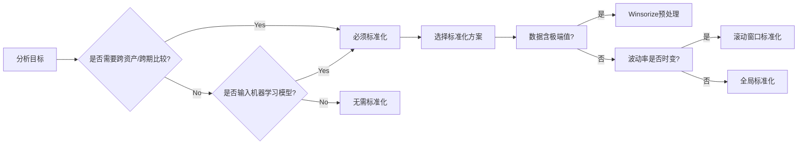

# 数据标准化

## 核心分析

### 对数收益率的性质

* 对数收益率通常已经接近于平稳序列（stationary），尤其是相比于价格序列。
* 但是，**不同资产或者不同时间段**的收益率可能具有不同的均值和方差（波动率聚集现象），因此标准化有时可以消除这些差异。

### 标准化的目的

* 模型要求：某些机器学习模型（如SVM、KNN、神经网络等）要求输入特征具有相同的尺度，以避免某些特征因为数值范围大而主导模型训练。
* 比较不同资产：如果我们需要比较不同资产的收益率，标准化可以消除量纲影响，使得不同资产之间的收益率具有可比性。
* 波动率建模：在金融时间序列中，**波动率（即标准差）**是随时间变化的。如果我们假设波动率是恒定的，那么标准化可能不合适。但如果我们使用GARCH等模型，通常会考虑波动率的变化，此时标准化可能不是必须的，因为模型本身会处理波动率。

### 实践中的考虑

* 训练集和测试集的划分：标准化时需要注意，必须使用训练集的均值和标准差来标准化测试集，否则会造成信息泄露。在时间序列中，这意味着只能使用历史数据（训练集）的均值和标准差来标准化当前数据（测试集）。
* 滚动标准化：在金融时间序列中，常常采用滚动标准化（例如使用过去N天的均值和标准差）来标准化当天的数据，以反映波动率的变化。

## 结论建议

### 不需要标准化的情况

* 如果你只是进行简单的统计描述（如计算平均收益率）或可视化，则不需要标准化。
* 如果你使用的时间序列模型（如ARIMA、GARCH等）本身可以处理非平稳的波动率，那么通常不需要标准化。
* 如果你使用树模型（如随机森林、梯度提升树）等对特征尺度不敏感的模型，通常不需要标准化。

### 需要标准化的情况

* 当你使用对特征尺度敏感的模型（如神经网络、SVM、PCA等）时，标准化可以提高模型性能。
* 当你需要将多个不同波动率的资产收益率放在一起比较或者作为模型的输入时（例如构建多资产模型），标准化可以使得各资产具有可比性。
* 在构建投资组合时，为了平衡不同资产的波动率，有时会采用标准化处理（但通常使用波动率倒数加权等方法更直接）。

## 操作建议

* 如果决定标准化，建议采用滚动窗口的方式进行标准化，以反映波动率的变化。例如，使用过去252个交易日（约一年）的均值和标准差来标准化当日的收益率：

```text
rolling_mean = returns.rolling(window=252).mean() 
rolling_std = returns.rolling(window=252).std() 
standardized_returns = (returns - rolling_mean) / rolling_std

注意：滚动标准化需要谨慎处理初期数据（前251个数据点不足窗口长度，需要处理NaN值）。
```

* 避免对整个时间序列使用固定的均值和标准差进行标准化，因为金融时间序列的波动率是时变的。

## 注意事项

* 标准差为零的情况：在滚动窗口内，如果所有收益率都相同（如新股上市初期交易天数不足，或者停牌期间），会导致标准差为零，从而产生除零错误。需要处理这种情况（例如，将标准化后的值设为零，或者跳过该窗口）。
* 缺失值处理：在计算滚动均值和标准差之前，需要确保没有缺失值。对数收益率序列通常不会有缺失值，但如果有，需要先填充（例如用0填充，或者用前后平均值填充）。

## 总结

对于A股指数对数收益率，是否需要标准化取决于具体应用场景和所使用的模型。如果你的模型对特征的尺度敏感，或者需要跨资产比较，那么标准化是有意义的；否则，可以直接使用对数收益率进行分析。

如果你有具体的应用场景（如预测、风险管理等），可以提供更多细节，以便给出更针对性的建议。

## 决策指南


