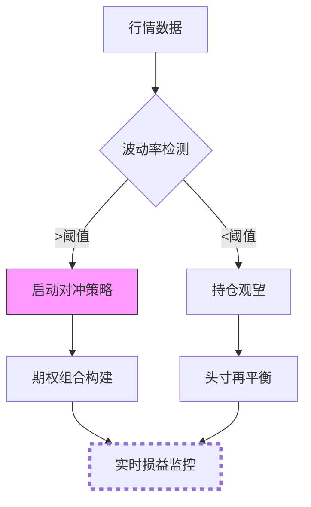
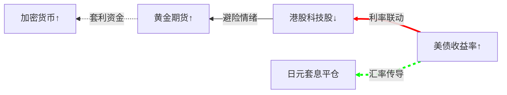
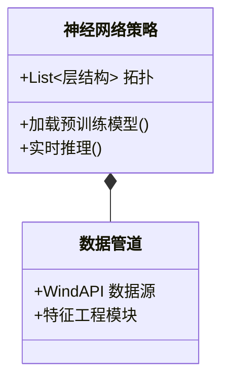

一、量化策略流程图

金融场景：日内波动率突破策略风控路径

⚡ 二、高频交易序列图
```mermaid
sequenceDiagram
    participant 行情API
    participant 信号引擎
    participant 风控网关 
    行情API->>信号引擎： 实时推送 
    信号引擎->>风控网关： 订单预检请求
    风控网关-->>信号引擎： 滑点/冲击成本分析 
    信号引擎->>交易所： 最优路由执行 
    Note over 风控网关： 纳秒级响应延时＜83ns
```
技术亮点：机构级高频系统交互协议

📅 三、策略开发甘特图
```mermaid
gantt
    title 多策略研发周期
    dateFormat  YYYY-MM-DD 
    section 趋势策略
    数据清洗   ：active, a1, 2025-06-10, 3d 
    参数优化   ：a2, after a1, 4d
    section 套利策略 
    价差建模   ：2025-06-12, 5d 
    实盘回测   ：crit, 2025-06-18, 7d
``` 
项目管理：AI量化团队敏捷开发模板

🎯 四、因子贡献雷达图

```mermaid
radarChart
    title 多因子权重分布 
    axis 估值, 动量, 质量, 波动率, 流动性 
    “策略A” ： [82, 65, 78, 90, 60]
    “策略B” ： [70, 88, 65, 75, 85]
    style “策略A” fill:#f9f9,stroke:#f00
```
量化应用：因子暴露可视化诊断工具

🔄 五、风险传染网络

风控创新：跨市场危机传导路径三维建模

💡 六、AI量化类图

前沿架构：端到端AI策略开发范式

📚 七、学习进阶路径
```mermaid
journey
    title Mermaid金融精通路线 
    section 基础阶段 
      语法速成： 3： 官方手册 
      量化模板： 5： GitHub案例
    section 实战阶段
      动态绑定： 7： D3.js 集成
      风险沙盘： 9： 监管级应用
    section 专家阶段
      量子渲染： 8： 超算加速 
      元宇宙推演： 6： VR融合 
```