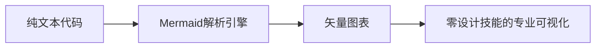
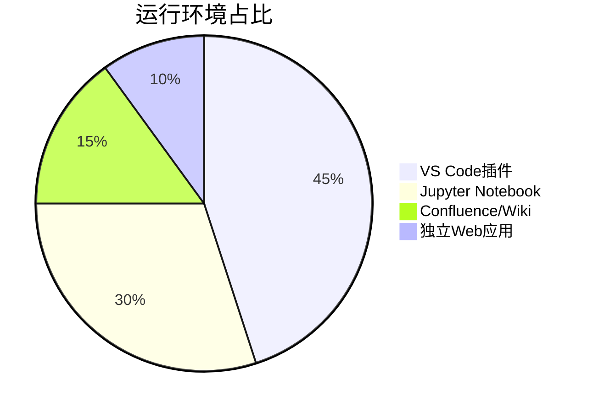
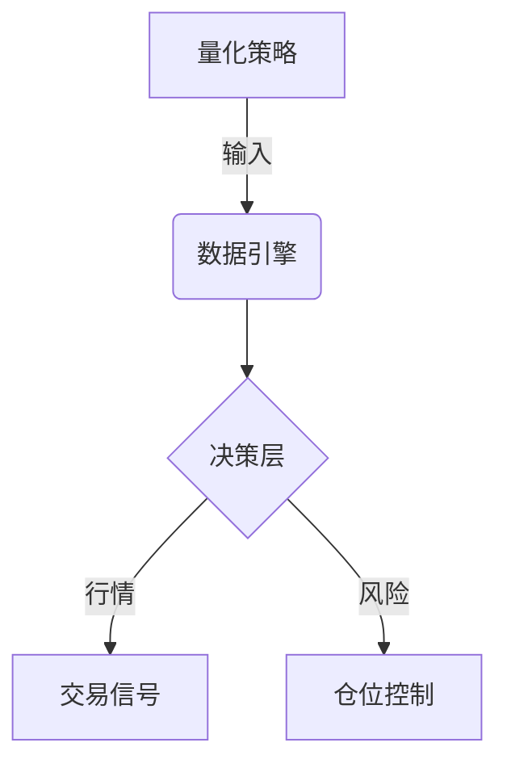
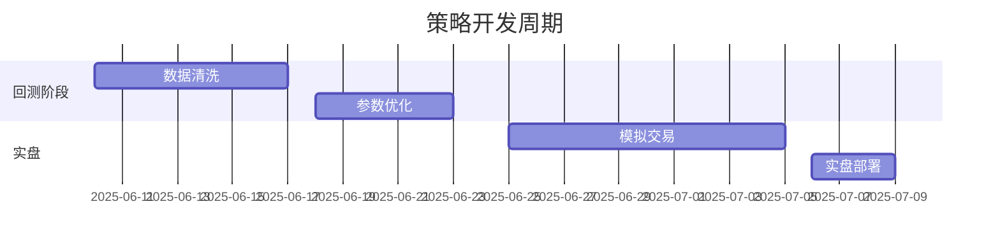
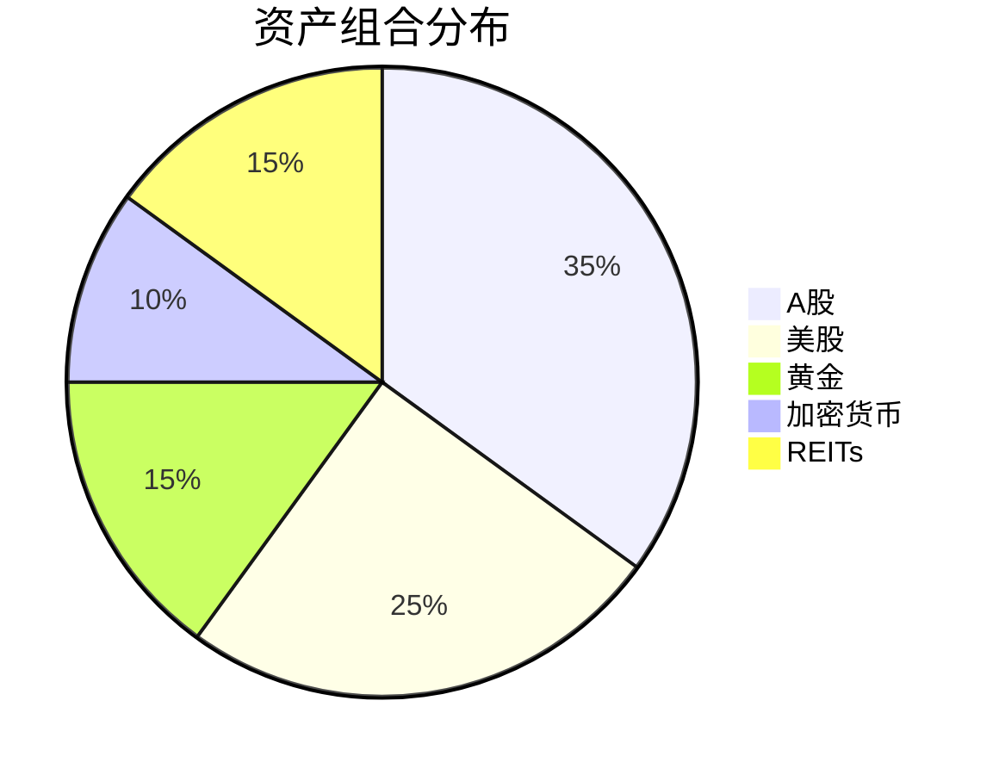
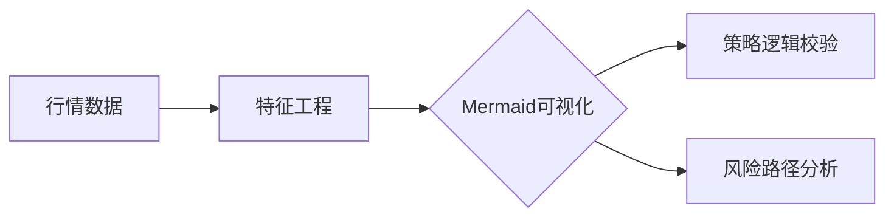
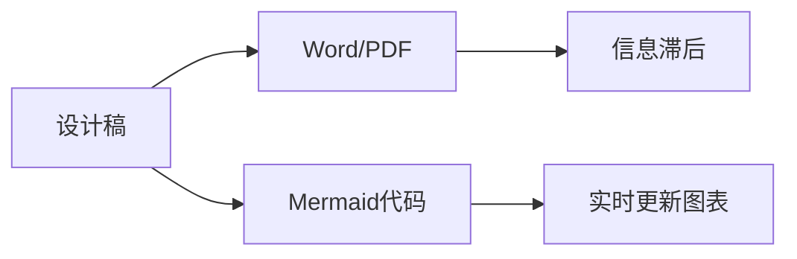
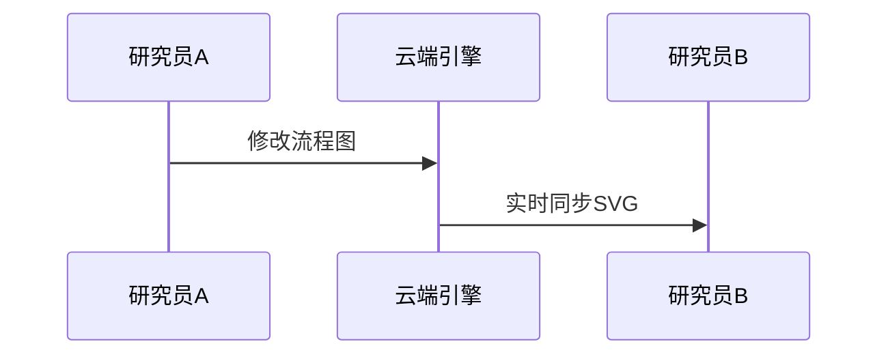
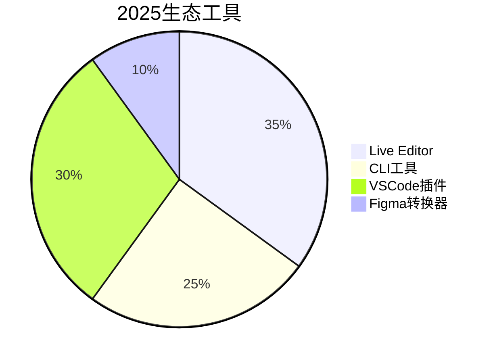
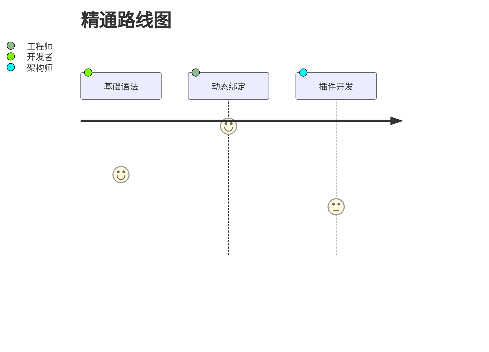

# 基础图形

## Mermaid 是一种基于Markdown的文本-图表转换语言



## 饼图



## 关系拓扑图



## 2. 时序分析图



2025强化：支持NLP自动解析时间描述生成甘特图

## 3. 金融专业图



行业首创：自动关联实时API数据更新（彭博/万得）

## 四、2025行业应用场景

### 1. 量化金融



案例：高盛用Mermaid优化套利策略决策路径，开发效率提升40%

### 2. 技术文档革命



效益：BlackRock年报制作周期从3周缩短至3天
### 3. AI协同开发

```python
# Mermaid语法自动生成（GPT-5插件）
def generate_gantt(project_desc):
    prompt = f"将项目描述转为Mermaid甘特图: {project_desc}"
    return gpt5.query(prompt,  format="mermaid")
```

## 五、未来演进方向

### 1. 三维空间可视化

```mermaid
graph 3D 
    node1[x,y,z] --> node2 
    node2 --> node3[属性球]
```

技术储备：WebGL+Three.js 融合渲染

### 2. 实时协作引擎



* 延迟目标: <100ms的多用户协同

## 开发者必知资源

### 1.官方工具链



### 2.学习路径


