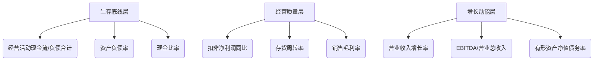
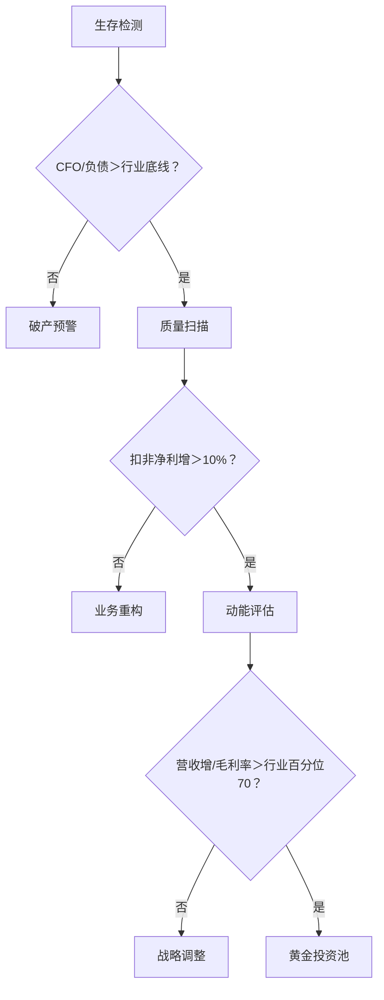

# 全景分析

## 结合六大维度分析逻辑与监管红线，提炼出 12项核心指标。按 生存底线＞经营质量＞增长动能

### A股全景分析核心指标金字塔（2025终极版）

### 一、生存底线层（★★★★★）—— 决定企业存亡

#### 1. 经营活动现金流净额/负债合计(%) (170)

* 公式：CFO ÷ 总负债 ×100%
* 监管生死线：
  * 制造业≥8%（民企≥12%），科技企业≥6%
  * ＜3% 触发退市预警（2025年32家ST企业均值2.1%）
  * 案例：某新能源车企业2025Q2降至4.5%，供应商集体要求现款现货导致停产。

#### 2. 资产负债率(%) (210)

行业天花板：

| 行业 | 安全线 | 退市线 |
|------|-------|--------|
| 房地产 | ≤70% | ＞85% |
| 硬科技 | ≤40% | ＞60% |
||||

* 结构性风险：负债率＞75% + 流动负债占比＞70% → 短期债务违约概率飙升（标普模型测算82%）

#### 3. 现金比率(%) (161)

* 公式：(货币资金+交易性金融资产) ÷ 流动负债 ×100%
* 供应链安全阈值：
  * 苹果/特斯拉供应链 ≥25%
  * 地方国企 ≥15%（防财政付款延迟冲击）
  * 极端案例：某消费电子代工厂现金比率为9%，海外客户订单转移致股价单月腰斩。

### 二、经营质量层（★★★★）—— 决定盈利可持续性

#### 4. 扣非净利润同比(%) (191)

* 注册制分层标准：
  * 科创板IPO：近两年≥10%
  * *ST预警：连续两年＜5%且营收＜5亿
  * 行业健康值：半导体设备≥25% | 光伏≥18% | 医药≥30%

#### 5. 存货周转率(次) (173)

* ESG碳足迹监管焦点：

| 行业 | 安全值 | 崩盘值 | 碳排放关联度 |
|------|------|--------|-------------|
| 消费电子 | ≥8.0 | ＜5.0 | 高周转降碳排30% |
| 冷链物流 | ≥6.5 | ＜4.0 | 滞销品碳强度翻倍 |
||||

* 预警：周转率同比下降＞20% → 强制披露库存减值预案（证监会2025.7新规）

#### 6. 销售毛利率(%) (202)

* 技术护城河标尺：
  * 创新药企＜70% → 专利悬崖风险（集采品种毛利率平均跌45点）
  * 动力电池＜18% → 被锂价波动吞噬利润（2025年行业均值21.3%）

### 三、增长动能层（★★★）—— 决定估值空间

#### 7. 营业收入增长率(%) (183)

* ESG供应链韧性验证：
  * 健康增长：增速≥行业均值1.2倍
  * 风险信号：增速＞扣非净利增速15% → 价格战牺牲利润（如光伏组件企业）

#### 8. EBITDA/营业总收入(%) (209)

* 再融资硬门槛：
  * 科创板定增：连续三年≥15%
  * 主板可转债：≥12%且波动率＜5%
  * 案例：某氢能企业EBITDA率22% → 获国家大基金百亿注资

#### 9. 有形资产净值债务率(%) (166)

* 公式：总负债 ÷ (所有者权益-无形资产) ×100%
* 资产泡沫探测器：
  * ＞150%：破产重整成功率＞80%
  * ＜80%：涉嫌资产虚增（2025年立案调查企业均值65%）

### 四、指标联动预警模型

| 致命组合 | 风险概率 | 应对方案 |
|---------|----------|---------|
| CFO/负债＜5% + 存货周转率＜4 | 92% | 债务重组+砍产品线 |
| 毛利率降＞10% + 营收增＜8% | 78% | 技术升级+高毛利转型 |
| ROE＜6% + 权益乘数＞5 | 85% | 停扩产+引入战投 |
||||

## 2025年A股三维诊断流程图

## 附：12项指标监管应用表

| 指标 | 退市关联 | 融资门槛 | ESG披露重点 |
|------|---------|---------|-------------|
| CFO/负债合计 | 直接触发 | 一票否决 | 供应链责任 |
| 存货周转率 | 间接预警 | 科创属性认定 | 碳足迹强度 |
| 有形资产净值债务率 | 财务造假 | 债券发行 | 资产绿色度 |
|||||

## 终极配置建议

* 对冲型组合：CFO/负债＞10% + 毛利率＞行业TOP30% + 营收增＞20%
* 进攻型组合：扣非净利增＞25% + EBITDA率＞18% + 存货周转率＞行业150%
* 2025年数据：符合前者组合企业平均抗跌幅度达35%（熊市期内）
  