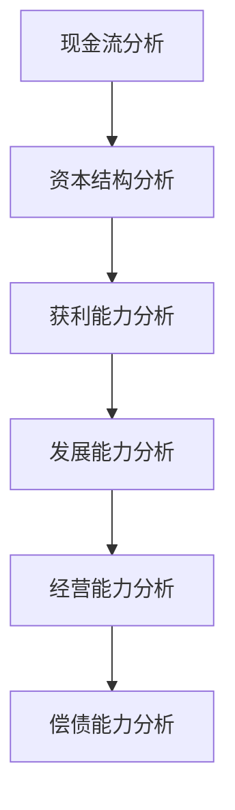
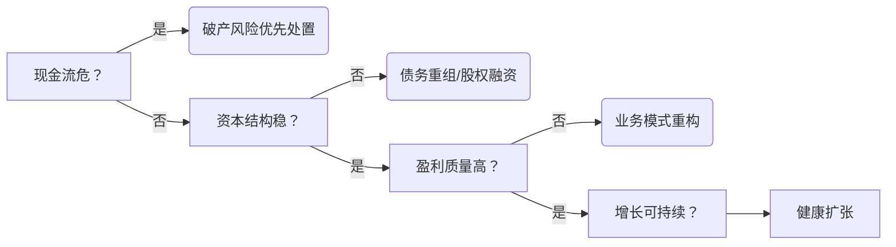

# 报表分析

## A、现金流分析（生存根基）★★★★★

核心逻辑：现金断流=企业猝死，其他分析失去意义
核心指标：

经营活动现金流净额（CFO）/营业收入：＞10%安全（科技企业＞5%）
自由现金流（FCF）= CFO - 资本开支：持续为正是扩张前提
现金再投资比率：FCF / (固定资产+无形资产) ＞20%
风险信号：CFO连续两季为负且融资现金流未覆盖

* 每股现金流量净额 (col225)
* 经营净额 (col107) (col7, col219每股)
* 投资净额 (col119)
* 筹资净额 (col128)
* 资本支出 (col224) 购建固定资产、无形资产等长期资产的现金支出
* 营业收入 (col74)
* 营业总收入 (col502万元)

### 1、自由现金流（Free Cash Flow,FCF）

* 企业经营活动净现金流扣除必要资本支出后的可自由支配现金。
* FCF = 经营活动现金流量净额 - 资本支出
* 企业自由现金流(col321每股) FCFF = FCF + 税后利息支出
* 股东自由现金流(col322每股) FCFE = FCFF - 税后利息支出 + 净借债

#### 决策信号

| 指标组合 | 隐含意义 | 风险提示 |
|--------|---------|-----------|
| FCFF >0，FCFE <0 | 企业整体健康，但偿债压力大或正在扩张，股东短期无现金可分。 | 高负债企业常见，需警惕债务风险。 |
| FCFF <0，FCFE >0 | 企业依赖新增债务维持股东回报（如借债分红），内生造血不足。 | 不可持续，可能陷入财务危机。 |
| 每股FCFF vs 股价 | 若每股FCFF持续高于股价，预示企业价值被低估。| 需结合行业周期验证（如能源业FCFF受大宗商品价格波动大）|

### 2、经营活动现金流量净额（Net Cash Flow from Operating Activities，CFO）

* 主营业务产生的现金流入与流出净额
* 揭示企业核心业务的真实造血能力，排除非经常性收益干扰（如资产变卖）。数值越高，盈利质量越可靠
* 持续为正且增长，表明产品畅销、回款高效（如低应收账款率），反之则暴露运营缺陷
* 是企业偿还短期债务（如应付账款、工资）的首要现金来源
  
### 3. 经营现金流量比率（Operating Cash Flow Ratio, OCFR）

* 经营活动现金流量净额 / 流动负债，衡量短期偿债能力，检验企业能否用经营现金覆盖年内到期债务。col107/col54
* 经营活动现金流量净额 / 总负债，评估长期偿债潜力，反映企业整体债务负担的可持续性。col107/col63
* 相比流动比率（含存货、应收账款），该指标聚焦真实现金偿付力，更可靠

#### 实务中优先关注短期比率的原因

* 1、风险预警更敏感
  * 短期比率＜1：直接警示企业可能无法用经营现金偿还到期债务，需依赖外部融资或资产变卖，易引发连锁违约风险
  * 长期比率低：若短期比率健康，可能因企业处于扩张期（如新建厂房），属阶段性现象
* 2、行业通用性更强
  * 不同行业的长期负债结构差异大（如房地产企业杠杆率高），但所有企业均面临短期债务压力
  * 权威机构（如信用评级公司）将短期比率纳入核心预警指标
* 3、与盈利质量关联更直接
  * 短期比率下降常伴随运营效率问题：如应收账款积压、存货滞销，直接影响经营现金流
  * 长期比率偏低可能仅反映资本结构选择（如低息环境下的主动加杠杆）

#### 需结合使用长期比率的场景

* 1、高杠杆行业（如房地产、航空业）
  * 长期负债占比超70%时，总负债比率能揭示债务到期集中度风险
* 2、长期负债占比超70%时，总负债比率能揭示债务到期集中度风险
  * 若大规模并购推高长期负债，需验证经营现金流能否支撑利息支出
* 3、投资者估值分析
  * 长期比率是DCF模型中评估企业整体价值的关键输入

#### 决策建议

* 第一步：筛查生存风险
  * 计算 经营现金流量净额 / 流动负债：
    * ＞1：安全（如苹果公司常年＞1.5）；
    * ＜0.5：高风险（需紧急核查应收账款周转率）。
* 第二步：评估发展健康度
  * 若短期比率健康，再计算 经营现金流量净额 / 总负债：
    * 持续下降趋势可能预示过度扩张（如某房企比率从0.3降至0.1后爆发债务危机）。
* 第三步：行业对标
  * 制造业：短期比率＞0.8为优；
  * 科技业：长期比率＞0.2即具投资价值（因轻资产特性）

### 销售现金比率（Cash Flow to Sales Ratio, SCFR）

* 经营活动现金流量净额 / 主营业务收入。
* 反映每元销售收入的实际现金回收率。高比率（如>15%）表明市场竞争力强、回款高效；低比率可能隐含赊销激进或客户违约风险

#### 决策应用：分行业健康基准参考

| 企业类型 | 现金流入/收入健康区间 | CFO净额/收入健康区间 | 关键逻辑 |
|---------|----------------------|--------------------|--------------|
| 成熟制造业 | 0.95~1.05 | 12%~20% | 供应链议价力强，净现金流稳定 |
| SaaS企业 | 0.85~0.98 | 8%~15% | 预收年费拉高现金流，但研发支出巨大 |
| 零售业 | 1.0~1.1 | 3%~8% | 薄利多销，净现金流敏感于周转效率 |
| 初创科技公司 | ≥0.8 | -15%~5% (看趋势) | 成长期容忍负值，但需边际改善 |

* 注：CFO净额/收入 ＜5% 为通用预警线（刚性支出覆盖不足）。

#### 最终建议

* 1、核心指标：
  * 优先监控CFO净额/收入（季度趋势＞单点值），警戒值：
    * 成熟企业＜8%
    * 成长企业连续两季＜0
* 2、辅助指标：
  * 当净额异常时，用现金流入/收入追溯：
    * 若同步下降 → 核查收入真实性（如虚构交易）
    * 若流入正常但净额恶化 → 彻查成本结构（如供应链失控）

## B、资本结构分析（抗风险骨架）★★★★☆

核心逻辑：资本结构决定破产概率与融资成本
核心指标：

有息负债率 = 有息负债/总资产 ＜50%（制造业＜60%）
股权融资占比：成长期＞40%降低风险
刚性债务覆盖率 = CFO /（短期借款+一年内到期债券）＞1.2
风险信号：有息负债率＞70%且CFO/利息＜3倍

## C、获利能力分析（存在意义） ★★★★

核心逻辑：盈利是企业可持续的根本
核心指标：

毛利率：行业均值+5%为优（如软件＞70%，硬件＞25%）
净现比 = CFO / 净利润 ＞1（盈利含金量）
ROIC（投入资本回报率） = EBIT*(1-税率) / (总资产-无息负债) ＞WACC+2%
风险信号：毛利率同比降＞10%且ROIC＜债务利率

## D、发展能力分析（未来空间） ★★★☆

核心逻辑：增长停滞将引发估值崩塌
核心指标：

营收复合增长率（CAGR）：＞行业增速2倍（科技企业＞25%）
客户留存率（SaaS）：＞90%为健康
研发费率：科技企业＞15%且资本化率＜30%
风险信号：营收增长但客户单价降＞20%（增长质量恶化）

## E、经营能力分析（效率引擎） ★★★

核心指标：

存货周转率（制造业）：＞6次/年（汽车行业＞8）
应收账款周转天数（DSO）：＜行业均值70%（如电商＜30天）
应付账款周转天数（DPO）：供应链议价力指标（如苹果DPO＞90天）
风险信号：存货周转率降幅＞营收降幅的2倍

## F、偿债能力分析（结果性指标） ★★☆

核心逻辑：前5项健康则偿债自然无忧
核心指标：

速动比率：＞1.2（剔除存货预付款）
EBITDA利息保障倍数：＞5倍（科技企业＞3）
债务/EITDA：＜3倍（重资产行业＜5）

## 决策应用：三阶诊断模型

### 行业特例修正

#### 房地产企业：资本结构分析升至首位（负债率＞80%即高危）

#### 生物科技公司：发展能力分析＞获利能力（容忍10年无盈利）

#### 消费品牌：经营能力＞资本结构（库存周转决定生死）

#### 终极公式

* 企业健康度 = max(0, CFO-刚性支出) × (1-有息负债率) × ROIC增速