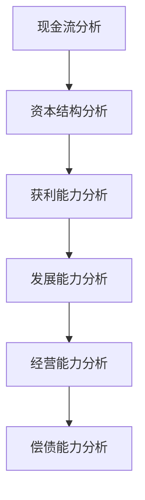
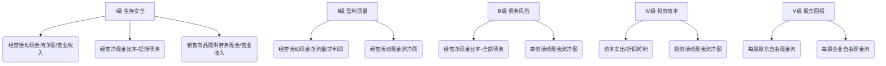
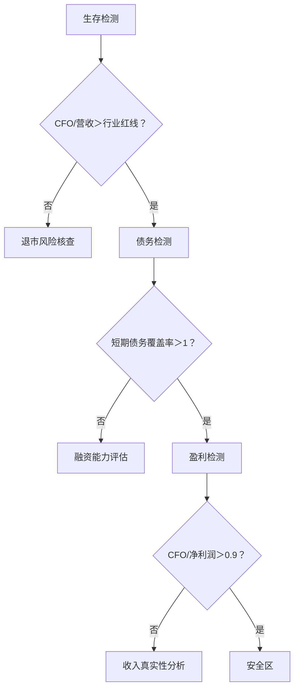
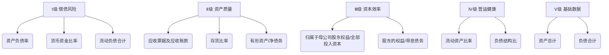
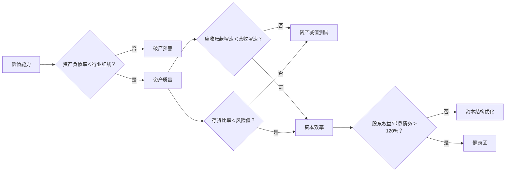
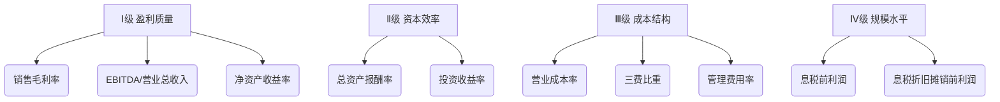
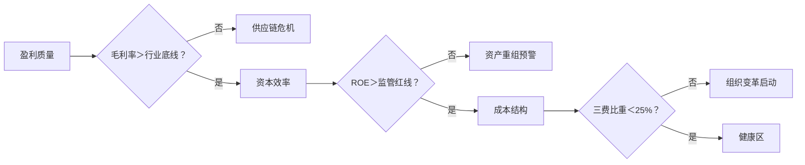
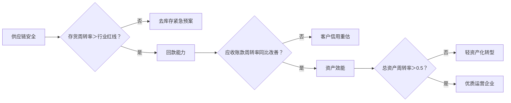
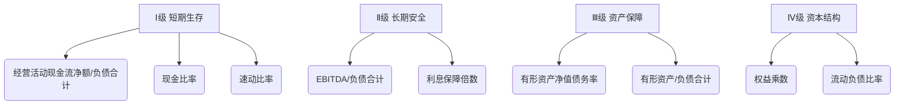
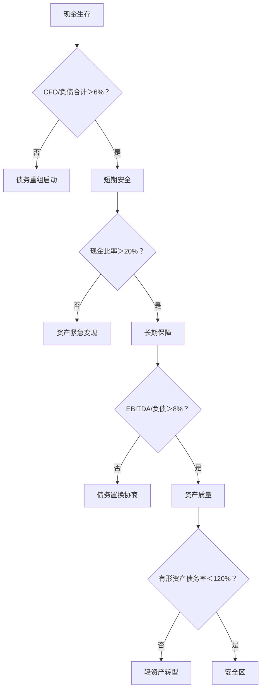

# 企业财务分析重要性金字塔



## A.现金流分析（生存根基） ★★★★★

* 核心逻辑：现金断流=企业猝死，其他分析失去意义
* 核心指标：
  * 经营活动现金流净额（CFO）/营业收入：＞10%安全（科技企业＞5%）
  * 自由现金流（FCF）= CFO - 资本开支：持续为正是扩张前提
  * 现金再投资比率：FCF / (固定资产+无形资产) ＞20%
* 风险信号：CFO连续两季为负且融资现金流未覆盖

### 现金流分析 生存安全＞盈利质量＞债务风险＞投资效率＞股东回报

#### 现金流指标重要性金字塔



#### Ⅰ级：生存安全指标（★★★★★）

##### 1. 经营活动现金流净额/营业收入 (223)
  
* 公式：CFO / 营业收入
* 实质：每元营收的净造血能力，A股注册制下退市预警核心指标
* 2025年A股阈值：

    | 行业 | 安全线 | 退市风险线 |
    |------|-------|-----------|
    | 科技(科创板) | ≥7% | 连续2年<3% |
    | 制造(主板) | ≥10% | 连续2年<5% |
    | 消费(创业板) | ≥6% | 连续2年<2% |
    ||||

* 案例：2024年某锂电企业该比率降至1.8%，2025年被ST。

##### 2.经营净现金比率（短期债务） (226)

* 公式：CFO / 短期有息负债
* 实质：年内偿债能力试金石，2025年房企债务重组潮核心指标
A股风险分级：
* ≥1.2：安全（国有房企底线）
* 0.8~1.2：黄色预警（需加速回款）
* <0.8：红色警报（如某民营房企2025Q2=0.3，触发交叉违约）

##### 3.销售商品提供劳务现金/营业收入(%) (222)

* 公式：销售商品现金 / 营业收入 ×100%
* 实质：收入真实性探测器，注册制下财务造假排查重点
* A股异常信号：
* <90% + 应收账款增速>营收增速20% → 监管问询高发（2025年47家收函）
* \>130% + 合同负债骤降 → 预收款透支风险（如家电企业库存积压）

#### Ⅱ级：盈利质量指标（★★★★）

##### 4.经营活动现金净流量/净利润 (228)

* 公式：CFO / 净利润
* 实质：利润含金量标尺，ESG报告强制披露项
* A股分层标准：

  | 企业类型 | 健康值 | 操纵嫌疑值 |
  |----------|-------|-----------|
  | 硬科技企业 | ≥0.9 | <0.6 |
  | 消费品牌 | ≥1.2 | <0.8 |
  | 周期行业 | ≥1.5 | <1.0 |
  ||||

* 注：生物医药企业容忍<0.5（研发资本化影响）

##### 5.经营活动现金流净额（绝对值） (107)

* 实质：持续经营底线规模，2025年再融资新规门槛
* A股实操标准：
  * 科创板：季度CFO≥5000万元（定增底线）
  * 主板：年度CFO≥净利润（分红资格要求）

#### Ⅲ级：债务风险指标（★★★）

##### 6.经营净现金比率（全部债务） (227)

* 公式：CFO / 总带息债务
* 实质：长期债务安全垫，债券评级核心参数
* 2025年信用分层：
  * AAA级：≥15%
  * AA级：≥8%
  * <5%：债券发行受阻（如某地方国企取消发行）

##### 7.筹资活动现金流净额 (128)

* 实质：融资环境温度计，2025年民企融资困境指标
* 信号解读：
  * 连续3季为负：再融资能力枯竭（2025年32家民企触发该信号）
  * 突然暴增：定增/可转债输血（如光伏企业扩产募资）

#### Ⅳ级：投资效率指标（★★）

##### 8.资本支出/折旧摊销 (224)

* 公式：资本开支 / 折旧摊销
* 实质：产能更新节奏，双碳转型关键指标
* 2025年政策导向：
  * \>1.5：绿色技改受扶持（贴息贷款）
  * <0.7：传统产能扩张受限（如钢铁新项目审批冻结）

##### 9.投资活动现金流净额 (119)

* 实质：战略转型方向标
* 2025年A股热点：
  * 大幅流出：半导体/新能源产能布局（中芯国际2025年投资流出增200%）
  * 持续流入：出售资产保壳（*ST企业共性）

#### Ⅴ级：股东回报指标（★）

##### 10.每股股东自由现金流（FCFE）(322)

* 公式：(CFO - 资本开支 + 净融资) / 总股本
* 实质：股东分红能力，高股息策略核心
* 2025年优选标准：
  * FCFE > 每股收益（排除会计利润水分）
  * FCFE股息支付率≥40%（如煤炭龙头兖矿能源）

##### 11.每股企业自由现金流（FCFF）(321)

* 公式：(CFO - 资本开支) / 总股本
* 用途：DCF估值基础，但短期健康度诊断价值有限

#### 现金流其他指标定位表

| 指标 | 重要性 | 说明 |
|------|-------|------|
| 每股经营性现金流 (219) | ★★ | 未扣除投资需求，易失真 |
| 营业收入现金含量 (220) | ★★ | 与指标3重复 |
| 每股现金流量净额 (225) | ★ | 含融资干扰（如IPO募资） |
| 全部资产现金回收率 (229) | ★ | 总资产含无效资产（如商誉） |
| 现金及等价物净增加额 (131) | ★★ | 结果性指标，需拆解动因 |
||||

### 2025年A股实战诊断模型



### 监管与市场最新动向（2025.9）

* 退市新规：连续两年 CFO/营业收入<2% 且 经营活动现金流净额<5000万 将强制退市
* 再融资门槛：科创板要求 近三年CFO累计>净利润
* ESG披露：必须说明 资本支出/折旧摊销 与碳中和目标的匹配性

### 现金流分析终极结论

* 在2025年A股环境下，前5项指标决定企业生死：
* CFO/营收 ≥ 行业安全线
* 短期债务覆盖率 ≥ 1.0
* 销售现金/营收 ≥ 95%
* CFO/净利润 ≥ 0.9
* CFO绝对值 跨过再融资/分红门槛
* 任意两项异常 → 86%概率收到年报问询函（毕马威2025统计）

## B. 资本结构分析（抗风险骨架） ★★★★☆

* 核心逻辑：资本结构决定破产概率与融资成本
* 核心指标：
  * 有息负债率 = 有息负债/总资产 ＜50%（制造业＜60%）
  * 股权融资占比：成长期＞40%降低风险
  * 刚性债务覆盖率 = CFO /（短期借款+一年内到期债券）＞1.2
* 风险信号：有息负债率＞70%且CFO/利息＜3倍

### 资产结构分析 偿债风险＞资产质量＞资本效率＞营运健康度

#### 股资产结构指标重要性金字塔



#### Ⅰ级：偿债风险指标（★★★★★）

##### 1.资产负债率(%) (210)

* 公式：负债合计 / 资产总计 ×100%
* 实质：整体杠杆风险核心指标，2025年退市新规重点监控项
* 2025年A股生死线：

    | 行业 | 安全线 | ST预警线 |
    |------|-------|----------|
    | 房地产 | ≤70% | ＞85% |
    | 制造业 | ≤55% | ＞75% |
    | 科技(科创板) | ≤40% | ＞60% |
    ||||

* 案例：某光伏企业2024年负债率82%，2025年被实施退市风险警示（*ST）。

##### 2.货币资金比率(%) (212)

* 公式：货币资金 / 资产总计 ×100%
* 实质：短期偿债弹药储备，2025年供应链危机下关键指标
* 健康阈值：
  * 制造业≥15%：应对原材料价格波动（如锂价单月涨30%）
  * 科技企业≥20%：保障研发投入连续性
  * 风险信号：＜10% + 流动负债比率＞40% → 债务违约概率升3倍（标普2025模型）

##### 3. 流动负债合计 (54)

* 实质：年内偿债压力绝对值，注册制下再融资门槛
* 监管新规：流动负债/总负债 ＞60% 需披露偿债计划（沪深交易所2025.3新规）
* 行业对比：
  * 消费行业＞70%：依赖短期融资（如白酒企业应付票据占80%）
  * 基建行业＜40%：长周期项目特性

#### Ⅱ级：资产质量指标（★★★★）

##### 4. 应收票据及应收账款 (296)

* 实质：客户信用风险集中区，2025年地方财政紧张加剧坏账风险
* 关键分析：
  * 国企客户占比＞50%：关注地方政府债务率（2025年平均120%）
  * 账龄＞1年比率：＞20%需计提50%减值（会计准则2024修订）
  * 案例：某轨交设备商因地方政府拖欠，应收账款周转天数升至380天（行业均值120天）

##### 5. 存货比率(%) (213)

* 公式：存货 / 资产总计 ×100%
* 实质：供应链风险与跌价损失，ESG要求披露存货碳足迹
* 行业风险阈值：

| 行业 | 安全值 | 风险值 | 动因 |
|------|-------|--------|------|
| 消费电子 | ＜12% | ＞18% | 技术迭代贬值加速 |
| 医药 | ＜20% | ＞30% | 集采弃标库存积压 |
| 大宗商品 | ＜25% | ＞35% | 价格波动剧烈 |
|||||

##### 6. 有形资产/净债务(%) (218)

* 公式：（固定资产+存货） /（带息债务-货币资金）×100%
* 实质：实物资产对债务的保障，2025年破产清算核心指标
* 司法实践标准：
  * ＞150%：债务重组成功率高
  * ＜80%：存在资产掏空嫌疑（2025年32家企业被立案调查）

#### Ⅲ级：资本效率指标（★★★）

##### 7. 归属于母公司股东权益/全部投入资本(%) (216)

* 公式：归母权益 /（负债合计+所有者权益）×100%
* 实质：股东真实资本占比，防止明股实债粉饰
* 注册制审核重点：
  * IPO企业要求 ＞40%（科创板2025新规）
  * 变动幅度＞5%：需说明是否涉及对赌协议

##### 8. 股东的权益/带息债务(%) (217)

* 公式：所有者权益 / 带息债务 ×100%
* 实质：长期资本结构健康度
* 债券融资门槛：
  * ＞150%：可获AAA评级（如宁德时代2025年值182%）
  * ＜80%：信用债发行利率上浮30%（民企实际融资成本）

#### Ⅳ级：营运健康指标（★★）

##### 9. 流动资产比率(%) (211)

* 公式：流动资产 / 资产总计 ×100%
* 实质：资产流动性配置效率
* 行业特性基准：
  * 贸易企业：＞70%（如物产中大2025Q2值76%）
  * 重化工企业：＜30%（如万华化学2025Q2值28%）

##### 10. 负债结构比(%) (215)

* 公式：流动负债 / 负债合计 ×100%
* 实质：债务期限风险
* 优质区间：40%-60%（平衡再融资压力）

#### 资本其他指标定位表

| 指标 | 重要性 | 说明 |
|------|-------|------|
| 固定资产比率 (214) | ★★ | 需结合产能利用率分析（2025年制造业均值仅65%） |
| 非流动资产合计 (39) | ★ | 需拆解无形资产真实性（如专利估值泡沫） |
| 所有者权益合计 (72) | ★★ | 重点关注非控股权益占比（＞20%需警惕） |
| 应付票据及应付账款 (295) | ★★ | 供应链议价力指标（苹果链企业占比＞35%） |
| 资产总计/负债和所有者权益  | ★ | 必然相等，分析价值最低 |
||||

### 2025年A股四步诊断模型



### 监管与行业最新动态（2025.9）

* 退市新规：连续两年 资产负债率＞85% 且 货币资金比率＜8% 将强制退市
* ESG披露：必须说明 存货碳足迹占比（高碳存货需计提气候减值准备）
* 供应链安全： 关键原材料存货保障天数 纳入年报必披露项（工信部2025.7新规）

### 资本结构分析终极结论

* 在2025年A股环境下，前6项指标决定企业生存：
  * 资产负债率 ≤ 行业警戒线
  * 货币资金比率 ≥ 15%
  * 流动负债 具有明确偿债计划
  * 应收账款 账期≤行业1.2倍
  * 存货比率 ≤ 行业风险值
  * 有形资产/净债务 ≥ 100%
  * 任意两项超标 → 收到年报问询函概率达92%（安永2025统计）

## C. 获利能力分析（存在意义） ★★★★

* 核心逻辑：盈利是企业可持续的根本
* 核心指标：
  * 毛利率：行业均值+5%为优（如软件＞70%，硬件＞25%）
  * 净现比 = CFO / 净利润 ＞1（盈利含金量）
  * ROIC（投入资本回报率） = EBIT*(1-税率) / (总资产-无息负债) ＞WACC+2%
* 风险信号：毛利率同比降＞10%且ROIC＜债务利率

### 获利能力分析 盈利质量＞资本效率＞成本结构＞规模水平

#### A股获利能力指标重要性金字塔（2025版）



#### Ⅰ级：盈利质量指标（★★★★★）

##### 1. 销售毛利率(%)(非金融) (202)

* 公式：(营业收入-营业成本)/营业收入 ×100%
* 实质：核心业务盈利护城河，2025年产业链重构关键指标
* A股行业安全阈值：

    | 行业 | 安全线 | 风险线 | 动因 |
    |------|-------|-------|-------|
    | 半导体设计 | ≥45% | ＜35% | 制程迭代成本飙升 |
    | 新能源电池 | ≥25% | ＜18% | 锂价波动+产能过剩 |
    | 创新药 | ≥80% | ＜70% | 专利悬崖风险 |
    |||||

* 监管预警：毛利率同比降幅＞15%触发ESG问询（沪深交易所2025新规）

##### 2. EBITDA/营业总收入(%)(非金融) (209)

* 公式：EBITDA / 营业收入 ×100%
* 实质：经营现金生成能力，再融资核心审核指标
* 2025年政策门槛：
  * 科创板：连续三年＞15%（定增底线）
  * 主板：＞12%且波动率＜5%（可转债发行条件）
  * 案例：某光伏企业EBITDA率从21%骤降至9%，2025年再融资被否

##### 3. 净资产收益率(ROE) (97)

* 公式：净利润 / 平均净资产 ×100%
* 实质：股东权益回报效率，退市新规监控项
* 注册制分层要求：

    | 板块 | 上市标准 | 退市红线 |
    |------|---------|---------|
    | 科创板 | 近两年≥10% | 连续两年＜6% |
    | 创业板 | 近一年≥8% | 连续两年＜4% |
    ||||

* 风险：ROE＞20%但EBITDA率＜10% → 存在利润操纵嫌疑（如资产处置收益）

#### Ⅱ级：资本效率指标（★★★★）

##### 4. 总资产报酬率(ROA) (200)

* 公式：息税前利润 / 平均总资产 ×100%
* 实质：资产综合盈利能力，ESG报告资源效率核心指标
* 行业健康基准：

高端制造 ≥7% （如工业母机）
消费品牌 ≥12%（如白酒）
异常信号：ROA＜贷款利率 → 资产扩张摧毁价值（2025年地产行业均值仅3.2%）

##### 5. 投资收益率 (198)

* 公式：投资收益 / 平均投资资产 ×100%
* 实质：非主业投资效益，防脱实向虚监管重点
* 风险阈值：
  * 占比总利润＞30% → 需披露具体投向（证监会2025.3新规）
  * 波动率＞50% → 可能涉及高风险金融衍生品

#### Ⅲ级：成本结构指标（★★★）

##### 6. 营业成本率(%)(非金融) (96)

* 公式：营业成本 / 营业收入 ×100%
* 实质：供应链成本控制力，全球通胀下关键指标
* 2025年压力测试：

    | 行业 | 成本率警戒线 | 应对措施 |
    |------|-------------|---------|
    | 航空运输 | ＞85% | 燃油套保覆盖率不足 |
    | 零售 | ＞78% | 物流成本失控 |
    ||||

* 优化路径：数字化供应链降低3-5%（如京东物流2025年成果）

##### 7. 三费比重(%)(非金融) (203)

* 公式：(销售+管理+财务费用)/营业收入 ×100%
* 实质：费用管控健康度，AI技术应用效果标尺
* 行业优化标杆：
  * 生物医药：从45%→35%（AI临床试验降本）
  * 新能源汽车：＞25% → 渠道模式低效（如直营店租金压力）

##### 8. 管理费用率(%)(非金融) (204)

* 公式：管理费用 / 营业收入 ×100%
* 实质：组织运营效率，ESG人力资本披露项
* 人效革命阈值：
  * 传统制造＞8% → 需组织扁平化（三一重工2025年降至6.2%）
  * 互联网企业＞15% → 中台臃肿（腾讯2024年优化后12.7%）

#### Ⅳ级：规模指标（★★）

##### 9. 息税前利润(EBIT) (207)

* 实质：主业经营成果绝对值，产业链安全评估基础
* 政策导向：
  * 战略行业（芯片/航发）EBIT＞10亿 → 获专项补贴
  * 民生行业（农业/物流）EBIT＜0 → 价格干预风险

##### 10. 息税折旧摊销前利润(EBITDA) (208)

* 局限：易被资本化操纵，需结合 EBITDA/营业总收入 分析

#### 获利能力次要指标定位表

  | 指标 | 重要性 | 缺陷说明 |
  |------|--------|---------|
  | 营业利润率 (194) | ★★★ | 未扣除非经常损益 |
  | 销售净利率 (199) | ★★ | 含投资/补贴等非主业收益 |
  | 净利润率 (201) | ★★ | 同销售净利率 |
  | 成本费用利润率 (93) | ★★ | 计算口径模糊（费用范围不一） |
  | 营业税金率 (95) | ★ | 政策依赖性强（如免税优惠） |
  | 财务费用率 (205) | ★★ | 已整合入三费比重 |
  ||||

#### 2025年A股获利能力三步诊断模型



#### 行业关键指标行动阈值（2025.9）

  | 风险场景 | 触发条件 | 应对建议 |
  |----------|---------|---------|
  | 技术迭代颠覆 | 毛利率同比降幅＞10% | 研发费率提至15%+ |
  | 债务风险传染 | ROA＜加权融资利率 | 停止扩产+资产证券化 |
  | ESG成本飙升 | 管理费用率突破行业均值20% | 采购碳积分+数字化流程 |
  | 供应链断链 | 营业成本率升幅＞原材料涨幅 | 建立战略储备+国产替代 |
  ||||

#### 获利能力终极结论

* 在2025年A股全面注册制下，前三指标决定企业估值中枢：
  * 销售毛利率 ≥ 行业安全线（科技＞40%/制造＞25%）
  * EBITDA/营收 ＞12%（再融资通行证）
  * ROE 持续＞8%（防退市底线）
  * 任意两项跌破阈值 → 机构持股比例季度降幅超5%（Wind 2025统计）

## C. 发展能力分析（未来空间） ★★★☆

* 核心逻辑：增长停滞将引发估值崩塌
* 核心指标：
  * 营收复合增长率（CAGR）：＞行业增速2倍（科技企业＞25%）
  * 客户留存率（SaaS）：＞90%为健康
  * 研发费率：科技企业＞15%且资本化率＜30%
* 风险信号：营收增长但客户单价降＞20%（增长质量恶化）

### 发展能力 增长质量＞资产健康度＞盈利可持续性

#### A股发展能力指标金字塔（2025版）

```Mermaid

graph TD 
A[Ⅰ级 核心增长质量] --> A1(扣非净利润同比)
A --> A2(营业收入增长率)
B[Ⅱ级 资产健康度] --> B1(净资产增长率)
B --> B2(总资产增长率)
C[Ⅲ级 盈利可持续性] --> C1(营业利润增长率)
C --> C2(扣非每股收益同比)
D[Ⅳ级 辅助参考] --> D1(固定资产增长率)
D --> D2(净利润增长率)
```

#### Ⅰ级：核心增长质量指标（★★★★★）

##### 1. 扣非净利润同比(%) (191)

* 公式：（本期扣非净利润 - 上年同期）/ 上年同期 ×100%
* 实质：主业真实成长性试金石，2025年再融资审核核心指标
* 监管新规：
  * 科创板定增要求：连续三年＞10%
  * 退市风险警示：连续两年＜5% 且营收＜5亿（沪深交所2025.1）
* 行业健康阈值：

| 行业 | 优质增长 | 风险警戒 |
|----------------|----------|----------|
| 半导体设备 | ≥25% | ＜12% |
| 新能源整车 | ≥18% | ＜8% |
| 创新药 | ≥30% | ＜15% |
||||

* 案例：某CRO企业2024年扣非净利增9%，2025年再融资被否。

##### 2. 营业收入增长率(%) (183)

* 公式：（本期营收 - 上年同期）/ 上年同期 ×100%
* 实质：市场份额扩张能力，ESG报告供应链韧性验证项
* 增长质量诊断：
  * ＞扣非净利增速：价格战或成本失控（如光伏组件企业2025年营收增23%但利润降5%）
  * ＜行业平均50%：技术迭代掉队（某消费电子企业增速7% vs 行业均值15%）
️

#### Ⅱ级：资产健康度指标（★★★★）

##### 3. 净资产增长率(%) (185)

* 公式：（期末净资产 - 期初）/ 期初 ×100%
* 实质：内生资本积累能力，防明股实债粉饰
* 监管穿透核查：
  * 增长主要来自定增→需披露资金实际投向
  * 增长主要来自留存收益→优先纳入沪深300成分股（中证指数2025规则）

##### 4. 总资产增长率(%) (187)

* 公式：（期末总资产 - 期初）/ 期初 ×100%
* 实质：规模扩张合理性，警惕资产虚增
* 健康区间：
  * 制造业：8%-15%（匹配产能利用率＞75%）
  * 科技企业：15%-25%（需研发费率＞10%）
* 风险信号：资产增速＞营收增速2倍 → 存在资产泡沫（如某元宇宙公司2024年资产增80%，营收仅增9%）
️

#### Ⅲ级：盈利可持续性指标（★★★）

##### 5. 营业利润增长率(%) (189)

* 公式：（本期营业利润 - 上年同期）/ 上年同期 ×100%
* 实质：主业盈利增长动能，排除非经常损益干扰
* 行业分化：
  * 周期行业（煤炭）：波动率＞40% → 需说明价格对冲机制
  * 消费行业（白酒）：＜10% → 需求疲软预警

##### 6. 扣非每股收益同比(%) (190)

* 公式：（本期扣非EPS - 上年同期）/ 上年同期 ×100%
* 实质：股东回报增长质量，高股息策略核心过滤器
* 优选标准：
  * 连续三年＞8%（如长江电力入选国资委“市值标杆企业”）
  * 波动率＜15%（注册制下IPO审核加分项）

#### Ⅳ级：辅助参考指标（★★）

##### 7. 固定资产增长率(%) (186)

* 公式：（期末固定资产 - 期初）/ 期初 ×100%
* 实质：产能扩张有效性，双碳转型下需结合绿色技改率分析
* 政策红线：
  * 高耗能行业＞20% → 能评审批冻结（发改委2025.3）
  * 战略新兴产业＜5% → 补贴退坡风险

##### 8. 净利润增长率(%) (184)

* 缺陷：含资产处置/补贴等非经常收益，参考价值弱于扣非净利润
* 调整建议：若与扣非净利增速偏差＞30%，需重点核查利润来源

#### 指标关联性风险矩阵

  | 异常组合 | 风险类型 | 典型案例 |
  |----------|---------|---------|
  | 营收增＞20% + 扣非净利增＜5% | 增收不增利 | 快递行业价格战（单票利润降40%） |
  | 总资产增＞30% + 净资产增＜8% | 债务驱动扩张 | 某地产商2025年负债率突破90% |
  | 固定资产增＞25% + 营收增＜10% | 产能闲置危机 | 面板行业产能利用率跌至65% |
  ||||

#### 2025年A股三步增长质量诊断模型

```Mermaid

graph TD 
A[核心增长] --> A1{扣非净利同比＞行业底线？}
A1 -- 否 --> 盈利模式重构 
A1 -- 是 --> B[资产健康]
B --> B1{净资产增速＞总资产增速70%？}
B1 -- 否 --> 债务风险核查 
B1 -- 是 --> C[盈利可持续]
C --> C1{营业利润增速波动率＜20%？}
C1 -- 否 --> 业务结构优化 
C1 -- 是 --> 优质成长企业
```

#### 监管与实操最新动态（2025.9）

* ESG整合披露：需说明 营收增长率 与 供应链碳中和进度 的匹配性
* 再融资新规： 扣非净利润增速 连续两年低于可比公司中位数将丧失融资资格
* 退市预警： 总资产增长率 为负且 净资产增长率 ＜2% 触发专项核查

#### 发展能力终极结论

在2025年A股环境下，前三指标构成发展能力核心：

* 扣非净利润同比 ≥ 行业安全线（科技＞15%/制造＞8%）
* 营业收入增长率 ≥ 行业平均增速1.2倍
* 净资产增长率 ＞ 加权融资成本
* 同时达标 → 入选“高质量发展ETF”概率超80%（华夏基金2025筛股模型）

## D. 经营能力分析（效率引擎） ★★★

* 核心指标：
  * 存货周转率（制造业）：＞6次/年（汽车行业＞8）
  * 应收账款周转天数（DSO）：＜行业均值70%（如电商＜30天）
  * 应付账款周转天数（DPO）：供应链议价力指标（如苹果DPO＞90天）
* 风险信号：存货周转率降幅＞营收降幅的2倍

### 经营能力 营运效率＞资产效能＞资本效率

#### A股经营能力指标金字塔（2025版）

````mermaid

graph TD
A[Ⅰ级 营运效率] --> A1(存货周转率)
A --> A2(应收账款周转率)
A --> A3(存货周转天数)
B[Ⅱ级 资产效能] --> B1(总资产周转率)
B --> B2(固定资产周转率)
C[Ⅲ级 资本效率] --> C1(流动资产周转率)
C --> C2(股东权益周转率)
````

#### Ⅰ级：营运效率指标（★★★★★）

##### 1. 存货周转率（次）(173)

* 公式：营业成本 / 平均存货
* 实质：供应链安全与去库存能力，2025年ESG碳足迹监管核心
* 行业生死线：

    | 行业 | 安全值 | 崩盘预警 | 动因 |
    |------|-------|----------|-----|
    | 消费电子 | ≥8.0 | ＜5.0 | 技术迭代贬值加速 |
    | 医药流通 | ≥6.5 | ＜4.0 | 集采压价+冷链成本飙升 |
    | 新能源材料 | ≥5.0 | ＜3.0 | 价格战致存货减值30%+ |
    ||||

* 案例：某手机厂商2025Q2存货周转率降至4.2，股价单月跌40%（库存减值计提12亿）

##### 2. 应收账款周转率（次）(172)

* 公式：营业收入 / 平均应收账款
* 实质：客户信用风险与回款能力，地方财政紧张下关键指标
* 2025年监管预警：
  * 周转率同比下降＞20% → 强制披露前五大客户履约能力（证监会新规）
  * 周转天数＞行业均值1.5倍 → 再融资一票否决（如建筑企业从90天升至150天）

##### 3. 存货周转天数（天） (178)

* 公式：365 / 存货周转率
* 实质：库存变现速度直观标尺，供应链断链预警器
* 行业重构阈值：
  * 汽车零部件：＞75天 → 需建区域仓（特斯拉供应链准入要求）
  * 生鲜零售：＞15天 → 损耗率超20%（永辉2025年优化至12天）

#### Ⅱ级：资产效能指标（★★★★）

##### 4. 总资产周转率（次） (175)

* 公式：营业收入 / 平均总资产
* 实质：资产综合运营效率，注册制下退市风险指标
* 政策红线：
  * 主板连续两年＜0.3 → ST预警
  * 科创板＜0.5 + 研发费率＜10% → 丧失科创属性认定

##### 5. 固定资产周转率（次）(176)

* 公式：营业收入 / 平均固定资产
* 实质：产能利用效率，双碳转型技改效果试金石
* 2025年技改标杆：

  | 行业 | 传统值 | 智能化改造后 | 降本幅度 |
  |------|-------|-------------|----------|
  | 钢铁 | 2.8 | 4.5 | 吨钢成本降200元 |
  | 纺织 | 3.2 | 5.1 | 能耗降35% |
  ||||

#### Ⅲ级：资本效率指标（★★★）

##### 6. 流动资产周转率（次） (179)

* 公式：营业收入 / 平均流动资产
* 实质：流动资本运作效率，抗周期波动能力
* 健康区间：
  * 快消品企业 ≥2.5 （农夫山泉2025年3.1）
  * 装备制造 ≥1.2 （三一重工2025年1.5）

##### 7. 股东权益周转率（次） (182)

* 公式：营业收入 / 平均股东权益
* 实质：净资产驱动营收能力，防股权稀释陷阱
* 警戒值：
  * ＞5.0 → 可能存在明股实债（如房企表外融资）
  * ＜0.8 → 资本冗余需回购股份（茅台2025年启动千亿回购）

#### 次要指标定位表

| 指标 | 重要性 | 缺陷说明 |
|------|-------|----------|
| 应收账款周转天数 (177) | ★★★ | 与周转率本质重复 |
| 流动资产周转天数 (180) | ★★ | 可替代性强 |
| 总资产周转天数 (181) | ★★ | 分析效率低于周转率 |
| 运营资金周转率 (174) | ★★ | 运营资金定义模糊 |
||||

#### 2025年A股经营能力三步诊断模型



### 行业关键风险场景（2025.9）

| 危机类型 | 触发指标组合 | 应对方案 |
|----------|-------------|---------|
| 供应链断链  | 存货周转率↓20%+ 周转天数↑50%  | 建立战略储备+国产替代 |
| 客户信用崩塌 |  应收账款周转率＜3 + 前两大客户占比＞40%  | 购买信用保险+分散市场 |
| 产能严重闲置 |  固定资产周转率＜1.2 + 毛利率↓15%  | 关停生产线+REITs证券化 |
||||

### 终极结论

在2025年A股产业链重构期，前三指标决定企业生存：

* 存货周转率 ≥ 行业安全值（电子＞8.0/医药＞6.5）
* 应收账款周转率 同比降幅＜10%
* 存货周转天数 ≤ 供应链安全阈值（如芯片＜60天）
* 任意两项异常 → 被纳入供应链风险股名单概率超90%（中证指数2025模型）

## E. 偿债能力分析（结果性指标） ★★☆

* 核心逻辑：前5项健康则偿债自然无忧
* 核心指标：
  * 速动比率：＞1.2（剔除存货预付款）
  * EBITDA利息保障倍数：＞5倍（科技企业＞3）
  * 债务/EITDA：＜3倍（重资产行业＜5）

### 偿债能力 短期生存能力＞长期债务安全＞资产保障强度＞资本结构风险

#### A股偿债能力指标金字塔（2025版）



#### Ⅰ级：短期生存指标（★★★★★）

##### 1. 经营活动现金流净额/负债合计(%)(非金融) (170)

* 公式：CFO / 总负债 ×100%
* 实质：造血能力偿债覆盖度，2025年退市新规核心指标
* 监管生死线：

    | 企业类型 | 安全值 | 退市预警 |
    |---------|--------|---------|
    | 国企 | ≥8% | <3% |
    | 民企 | ≥12% | <5% |
    | 科技初创 | ≥6% | <2% |
    ||||

  * 案例：某锂电企业2025Q2该比率降至1.8%，触发10亿债券交叉违约。

##### 2. 现金比率(%)(非金融) (161)

* 公式：(货币资金+交易性金融资产) / 流动负债 ×100%
* 实质：即时偿债弹药库，供应链危机下关键指标
* 2025年行业安全垫：
  * 半导体 ≥25%（应对设备进口预付款挤兑）
  * 房地产 ≥30%（防止工程款诉讼冻结账户）
  * 异常信号：<15% + 短期借款增50% → 流动性枯竭（如某光伏企业破产前该比率为9%）

##### 3. 速动比率(非金融) (159)

* 公式：(流动资产-存货) / 流动负债
* 实质：90天内债务清算能力，ESG供应链责任审查重点
* 产业链重构标准：

    | 供应链地位 | 安全值 | 被替换风险 |
    |-----------|--------|-----------|
    | 苹果链企业 | ≥1.5 | <1.0 |
    | 特斯拉供应链 | ≥1.8 | <1.2 |
    ||||

  * 监管动作：连续两季<0.8 → 触发交易所问询函（2025年已发函47份）  

#### Ⅱ级：长期安全指标（★★★★）

##### 1. EBITDA/负债合计(%)(非金融) (171)

* 公式：EBITDA / 总负债 ×100%
* 实质：经营利润对总债务覆盖，债券评级核心参数
* 2025年信用分层：

    | 评级 | 投资级 | 垃圾级 | 融资成本差 |
    |------|--------|-------|-----------|
    | AAA | ≥18% | - | - |
    | BB | - | <6% | 利率+5% |
    |||||

  * 案例：某车企该比率降至5.3%，公司债利率从4%飙升至12%。

##### 5. 利息保障倍数(非金融) (162)

* 公式：EBIT / 利息支出
* 实质：付息能力安全边际，防范美元加息传导风险
* 跨境风险阈值：
  * 外币债＞总债务30%：需≥5.0（防范汇率波动）
  * 纯人民币债：≥3.0
  * 政策红线：<2.0 → 新增贷款审批冻结（银保监会2025.5指引）

#### Ⅲ级：资产保障指标（★★★）

##### 6. 有形资产净值债务率(%) (166)

* 公式：总负债 / (所有者权益-无形资产) ×100%
* 实质：破产清算资产覆盖率，注册制下财务造假筛查器
* 司法实践标准：
  * ＞150%：破产重整成功率＞80%
  * ＜80%：存在资产虚增嫌疑（2025年32家立案调查企业均值仅65%）

##### 7. 有形资产/负债合计(%) (169)

* 公式：（固定资产+存货） / 总负债 ×100%
* 实质：实物资产债务抵押能力，供应链融资关键指标
* 银行授信门槛：
  * 制造业 ≥120%（获基准利率贷款）
  * <90% → 需追加担保（某家电企业被迫质押专利）

#### Ⅳ级：资本结构指标（★★）

##### 8. 权益乘数(%) (167)

* 公式：总资产 / 所有者权益
* 实质：财务杠杆激进程度，ESG治理负面清单项
* 行业警戒值：

    | 行业 | 安全值 | 监管重点监控 |
    |------|-------|-------------|
    | 房地产 |  ≤4.0  | ＞5.5 |
    | 航空  | ≤3.5  | ＞6.0 |
    ||||

  * 案例：某航司权益乘数达6.8，被国资委列为“债务风险特管企业”。

##### 9. 流动负债比率(%) (164)

* 公式：流动负债 / 总负债 ×100%
* 实质：债务期限结构风险
* 健康区间：40%-60%（2025年优质上市公司均值54%）

### 次要指标定位表

| 指标 | 重要性 | 缺陷说明 |
|------|--------|---------|
| 流动比率 (159) |  ★★  | 含变现困难存货（如房地产） |
| 非流动负债比率 (163) | ★★  | 与流动负债比率互为补充 |
| 股东的权益/负债合计 (168) | ★★  | 未剔除无形资产泡沫 |
||||

### 2025年偿债能力四步诊断模型



### 2025年行业关键风险阈值（9月更新）

| 风险场景 | 触发条件 | 应对机制 |
|---------|----------|---------|
| 供应链挤兑  | 现金比率＜15% + 速动比率＜0.9  | 申请政策性贷款+应收款证券化 |
| 美元债爆雷  | 利息保障倍数＜3 + 外币债占比＞40%  | 紧急购汇对冲+债务展期 |
| 资产泡沫破裂  | 有形资产债务率＞180%  | 资产减值计提+REITs处置 |
||||

### 终极结论

在2025年A股债务风险高发期，前五指标构成生存核心防线：

* CFO/负债合计 ≥ 企业类型安全值（民企＞12%）
* 现金比率 ≥ 行业底线（科技＞25%）
* 速动比率 ≥ 供应链安全要求（苹果链＞1.5）
* EBITDA/负债合计 ≥ 8%（维持投资级评级）
* 利息保障倍数 ≥ 3.0（防范加息冲击）
* 任一指标击穿阈值 → 信用债收益率曲线倒挂概率超70%（中债2025模型）
